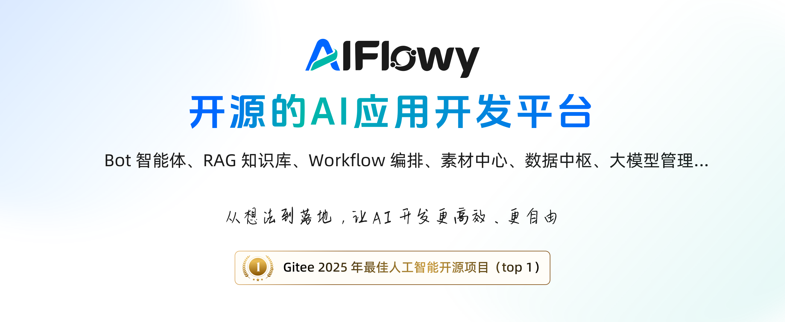
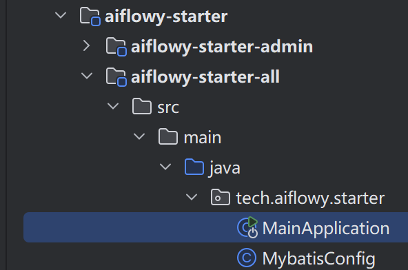
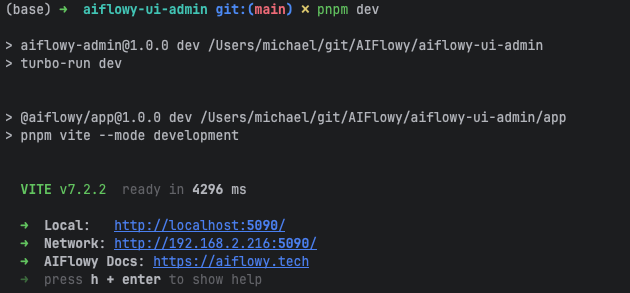
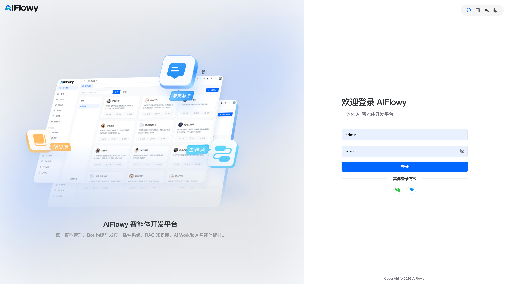

# 快速开始

## 欢迎使用 AIFlowy

感谢您选择 AIFlowy！本指南将帮助您在几分钟内完成本地环境搭建并成功运行 AIFlowy。  
如在使用过程中遇到问题，欢迎加入 [AIFlowy 技术交流群](#)（请替换为实际链接）进行讨论。


## 本章目标

- 快速完成 AIFlowy 后端与前端的本地部署
- 验证系统是否正常运行
- 为后续开发与定制打下基础


## 环境要求

AIFlowy 采用现代化技术栈，需确保您的开发环境满足以下要求：

### 后端（Java）
- **JDK 17+**（推荐 OpenJDK 17）
- **Maven 3.9+**
- **MySQL 8.x**

### 前端（Web）
- **Node.js v22+**
- **pnpm v10+**

> 💡 提示：可通过 `java -version`、`mvn -v`、`node -v`、`pnpm -v` 等命令验证版本。


## 1. 启动后端服务

### 1.1 导入项目到 IDEA

1. 打开 IntelliJ IDEA
2. 选择 **File → Open**，定位到 AIFlowy 项目根目录并打开  
   

### 1.2 初始化数据库

1. 在 MySQL 中创建数据库（例如 `aiflowy`）
2. 执行项目根目录 `/sql` 下的两个脚本：
    - `aiflowy-v2.ddl.sql`（建表）
    - `aiflowy-v2.data.sql`（初始数据）

> ✅ 建议使用 `utf8mb4` 字符集和 `utf8mb4_unicode_ci` 排序规则。

### 1.3 配置数据库连接

编辑 `aiflowy-starter/aiflowy-starter-all/src/main/resources/application.yml`，更新以下内容：

```yaml
spring:
  datasource:
    url: jdbc:mysql://127.0.0.1:3306/aiflowy?useInformationSchema=true&characterEncoding=utf-8
    username: root
    password: 123456
```

> ⚠️ **注意**：`useInformationSchema=true` 是必须的，用于支持 MyBatis-Flex 正确读取表注释。

#### （可选）配置文件存储方式

##### 本地存储（默认）
```yaml
spring:
  web:
    resources:
      static-locations: file:/your/local/path  # 例如：file:/www/aiflowy/file（Linux）或 file:C:/aiflowy/file（Windows）

aiflowy:
  storage:
    local:
      root: /your/local/path
      prefix: 'http://localhost:8080/static'
```

##### S3 兼容存储（如 MinIO、AWS S3）
```yaml
aiflowy:
  storage:
    type: s3
    s3:
      access-key: your-access-key
      secret-key: your-secret-key
      endpoint: "http://your-s3-endpoint"
      region: "your-region"
      bucket-name: "your-bucket"
      access-policy: 2  # 1=私有, 2=公共读
      prefix: public
```

### 1.4 编译并启动应用

1. 在项目根目录执行 Maven 编译：
   ```bash
   mvn clean package -DskipTests
   ```
   

2. 编译成功后，运行主启动类：
    - 模块：`aiflowy-starter-all`
    - 类路径：`com.aiflowy.starter.MainApplication`

   

> 🔧 **常见问题**：若提示 `Command line is too long`，请在 IDEA 运行配置中将 `Shorten command line` 改为 **JAR manifest**  
> 


## 2. 启动前端控制台

### 2.1 安装依赖

进入前端目录并安装依赖：

```bash
cd aiflowy-ui-admin
pnpm install
```

> 🌐 **网络问题处理**（如 400/500 错误）：
> ```bash
> npm config set proxy null
> npm config set https-proxy null
> npm cache clean --force
> npm config set registry https://registry.npmmirror.com
> ```

### 2.2 启动开发服务器

```bash
pnpm dev
```

成功启动后，终端将显示访问地址（默认 `http://localhost:8899`）：  


打开浏览器访问该地址，看到登录页即表示前端启动成功：  


> 🔑 **默认账号**：`admin` / `123456`


## 下一步

🎉 恭喜！您已成功运行 AIFlowy。  
接下来，您可以：
- 阅读 [核心概念](#) 了解架构设计
- 查看 [API 文档](#) 接入自定义智能体
- 加入社区讨论定制化需求与最佳实践

> 📣 如遇问题，请优先查阅 [常见问题 FAQ](#) 或联系社区支持。

