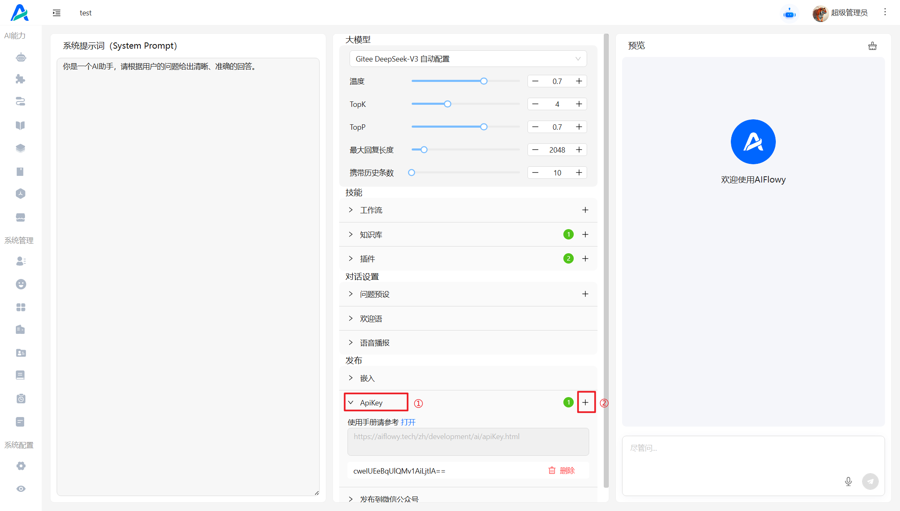

# 通过 ApiKey 请求 bot

ApiKey 的作用是 用于身份认证，通过 ApiKey 第三方可以携带对应的参数访问到 AIFlowy 对应的Bot进行对话。

## 创建 apiKey 

进入 bot 设置页面，找到 apiKey 这一栏，点击右上角 "+" 号，在弹窗点击确认，即可完成 apiKey 的创建


## 第三方接入 Bot 聊天地址：
请求方式： POST
请求地址： http://127.0.0.1:8080/v1/chat/completions


**此接口兼容 openAi api**

### 请求示例
请求头：

Headers: {
Authorization: Bearer 你在 bot 上生成的 apiKey
}


请求示例1：
```json
{
  "model": "gpt-4",
  "messages": [
    {
      "role": "user",
      "content": "Hello, how are you?"
    }
  ]
}
```
请求示例2：
```json
{
  "model": "gpt-4",
  "messages": [
    {
      "role": "user",
      "content": "Hello, how are you?"
    }
  ],
  "max_tokens": 500,
  "temperature": 0.7,
  "stream": false
}
```


请求成功示例：
```json
{
    "status": "END",
    "usage": {
        "completionTokens": 3,
        "promptTokens": 22,
        "totalTokens": 25
    },
    "created": 1745205152874,
    "choices": {
        "index": 0,
        "message": {
            "content": "你叫什么名字？",
            "role": "assistant"
        }
    }
}
```

### stream 格式返回

参数说明：

```
stream: true 表示以流式返回
```

请求示例：
```json
{   
    "stream": true,
    "messages": [

        {
            "role": "user",
            "content": "你好"
        },
          {
            "role": "assistant",
            "content": "你好我是科大讯飞模型"
        },
         {
            "role": "user",
            "content": "你叫什么名字?"
        }
    ]
  
}
```

返回参数说明：
```
status: START 表示本次对话开始
status: MIDDLE 表示本次对话进行中
status: END 表示本次对话正常结束
```

请求成功示例：

```json
{
    "status": "START",
    "created": 1745205750472,
    "choices": {
        "delta": {
            "content": "我的名字叫讯",
            "role": "assistant"
        },
        "index": 0
    }
}

```

```json
{
    "status": "MIDDLE",
    "created": 1745205750750,
    "choices": {
        "delta": {
            "content": "认知大模型，很高兴",
            "role": "assistant"
        },
        "index": 0
    }
}
```

```json
{
    "status": "END",
    "created": 1745205750901,
    "choices": {
        "delta": {
            "content": "为你服务。",
            "role": "assistant"
        },
        "index": 0
    }
}
```