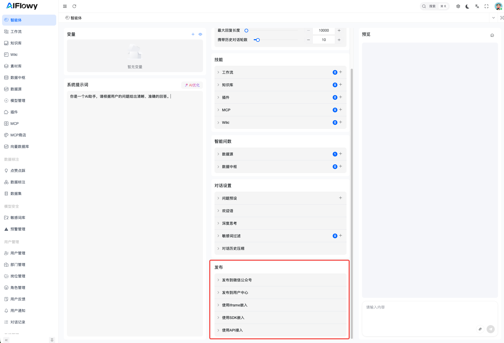

# Bot 集成与嵌入

AIFlowy 提供了多种 Bot 集成方式,让您能够将聊天助手灵活地嵌入到不同的应用场景中。使用以下除 API 以外的集成方式都需要先配置您用户中心的域名：

## 发布到用户中心

您可以将 Bot 发布到用户中心,让其他用户能够直接访问和使用。

### 操作步骤

1. 进入 Bot 设置页面
2. 找到 **发布到用户中心** 配置项
3. 打开开关即可发布 Bot
4. 发布成功后,可以点击 **打开用户中心** 查看已发布的 Bot

## iframe 嵌入

通过 iframe 方式,您可以将 Bot 嵌入到任何网页中,让用户在您的网站上直接使用聊天功能。

### 使用步骤

1. 进入 Bot 设置页面
2. 找到 **使用 iframe 嵌入** 配置项
1. 复制基础嵌入代码或完整示例
3. 将代码粘贴到您的网页 HTML 中
4. 根据需要调整 width、height 等参数

## SDK 嵌入

AIFlowy WebSDK 是一个轻量级的 JavaScript SDK，允许您在任何网站中快速嵌入 AI 对话组件。通过简单的配置，即可为您的网站添加 AI 助手能力。

### 使用步骤

1. 进入 Bot 设置页面
2. 找到 **使用 SDK 嵌入** 配置项
1. 复制嵌入代码
3. 将代码粘贴到您的网页 HTML 中

详细的 SDK 文档请访问: [https://docs.aiflowy.tech/zh/development/websdk/websdk.html](https://docs.aiflowy.tech/zh/development/websdk/websdk.html)

## API 接入

如果您需要完全自定义 Bot 的交互界面,可以使用 API 方式直接调用 Bot 的对话接口。

详细的 API 文档请访问: [https://api.aiflowy.tech/bot/chat](https://api.aiflowy.tech/bot/chat)
