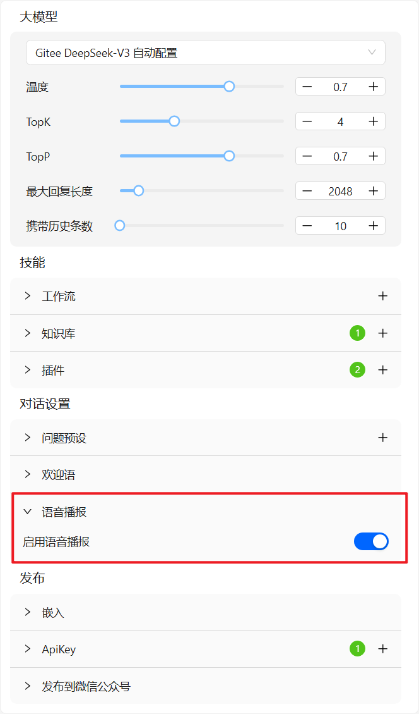
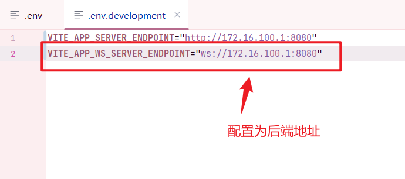
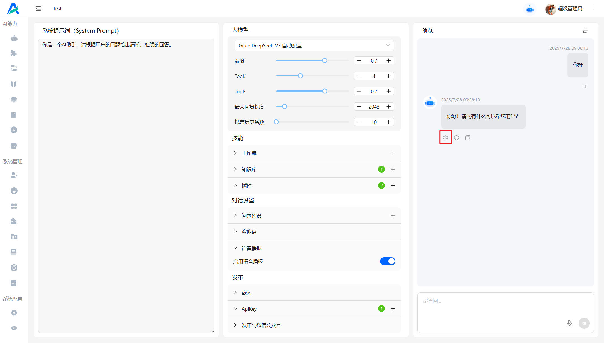

# 实时语音播报
## 开启语音播报功能
>在 bot 设置页面中，开启语音播报功能
> 

> 在前端 .env 中（开发环境为 .env.development），配置 WebSocket 连接变量
> 

> 在后端 application.yaml 配置火山引擎的 tts 服务（目前仅实现火山引擎）
```yaml
voiceInput:
  volcengine:
    app:
      appId: 你的 appId
      token: 你的 token
      cluster: 此配置为语音输入时需要的配置，在火山引擎开通语音识别功能后，从控制台获取
```
配置完成后，与 bot 对话，即可实时语音播报。

