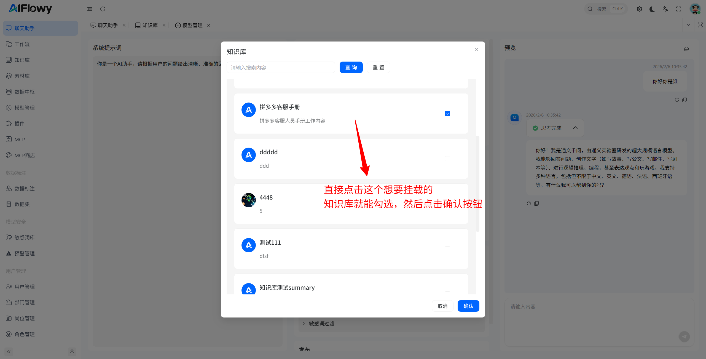
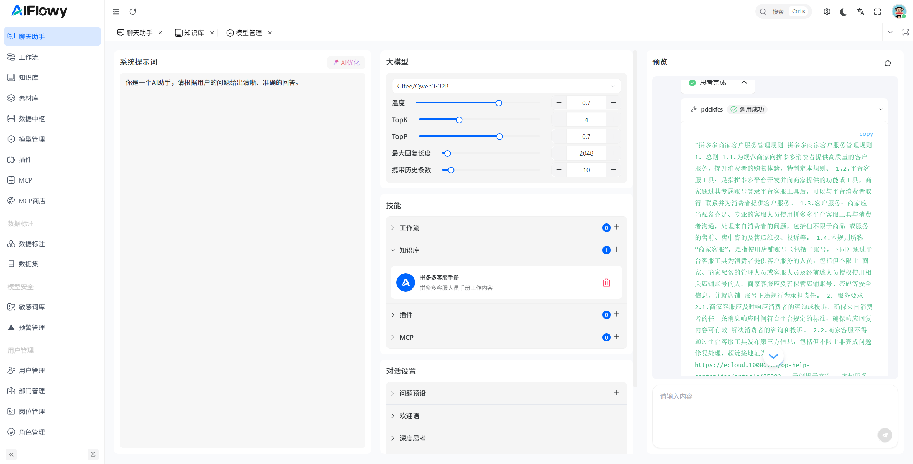
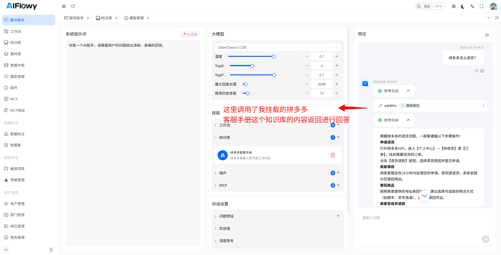

# 挂载知识库

## 1. 创建知识库
创建知识库请参考 [如何创建一个知识库](/zh/product/knowledge/create-knowledge)

## 2. 挂载知识库
挂载知识库首先点击左侧菜单栏的 **聊天助手** 进入 **聊天助手** 对话页面，点击**技能**模块下的知识库右侧的 + 号，进入知识库的挂载选择页面,
挂载知识库之前，我已经创建了一个名为 **拼多多客服手册** 的知识库

## 3. 知识库测试
如图 聊天助手 根据用户的输入，从知识库中检索出答案，得到的答案是经过大模型处理过的，所以答案会更加准确
    

