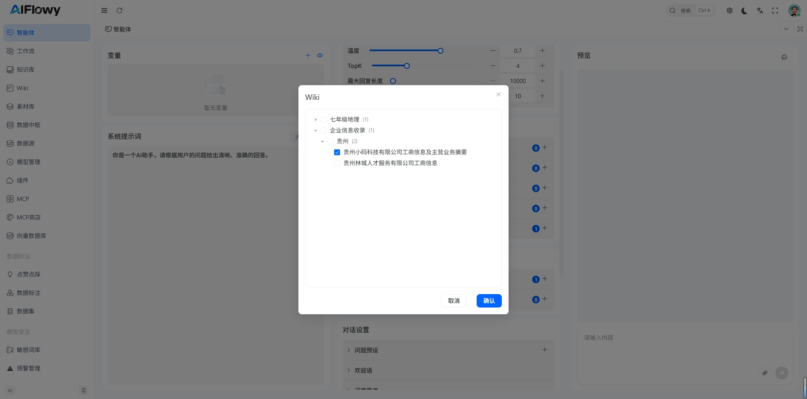
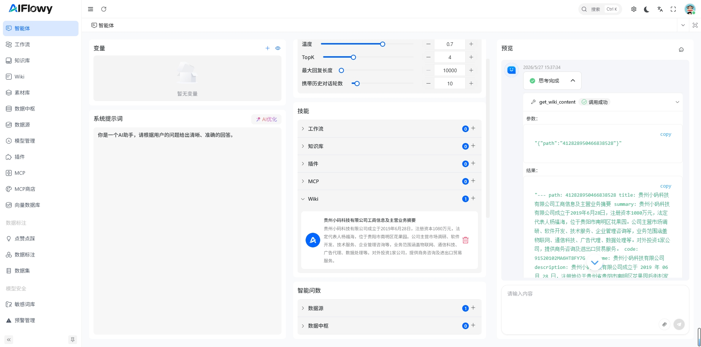
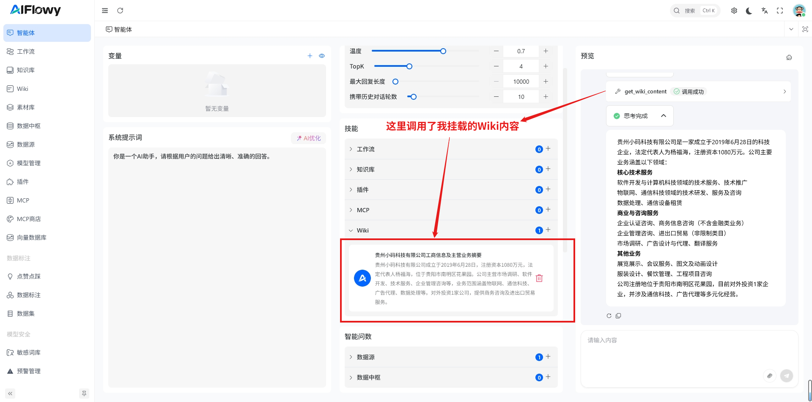

## 1. 创建Wiki

创建Wiki请参考 [如何创建一个Wiki](../wiki/what_is_wiki.md)

## 2. 挂载Wiki
挂载Wiki首先点击左侧菜单栏的 **智能体** 进入 **设置页面**，点击**技能**模块下的Wiki右侧的 + 号，进入Wiki的挂载选择页面,
挂载Wiki之前，我已经创建了一个名为 **贵州小码科技有限公司工商信息及主营业务摘要** 的Wiki

## 3. Wiki测试
如图 智能体 根据用户的输入，从Wiki中检索出答案，得到的答案是经过大模型处理过的，所以答案会更加准确
    

