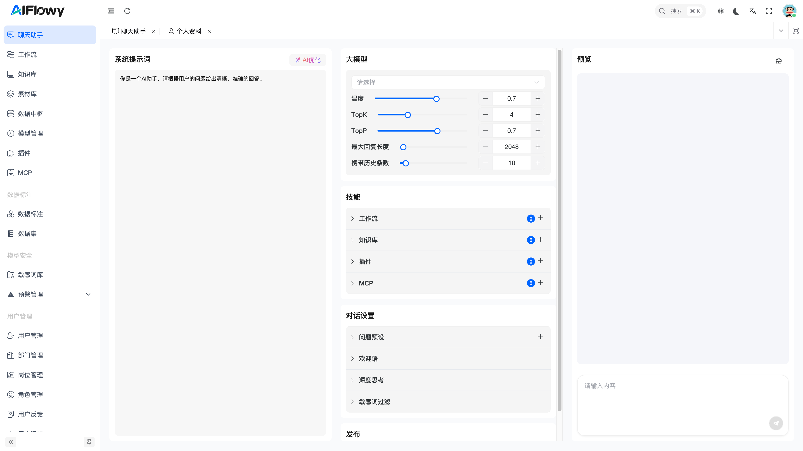
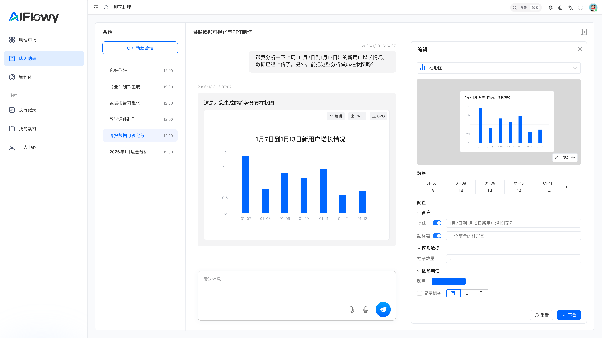

# 什么是聊天助手？

在 AIFlowy 平台中，“聊天助手”是一个强大的、可高度定制化的 AI 智能体。它不仅仅是简单的问答机器人，而是一个能够理解上下文、调用多种工具、并根据您的特定需求提供精准服务的虚拟助理。

简单来说，**聊天助手 = 核心大模型 + 您定义的角色与技能 + 专属对话体验**。

通过配置“聊天助手”，您可以创建一个完全属于自己的 AI 助理，用于处理客服咨询、内部知识查询、代码生成、流程自动化等多种复杂任务。

## 一、 聊天助手的核心构成

一个完整的聊天助手由以下几个核心部分组成：

### 1. 系统提示词 (System Prompt)
这是定义聊天助手“人设”和“行为准则”的核心指令。
*   **作用**：告诉 AI 它是谁，应该做什么，以及如何回答问题。
*   **示例**：如图所示，默认提示词是“你是一个AI助手，请根据用户的问题给出清晰、准确的回答。” 您可以将其修改为更具体的指令，例如：“你是一个资深数据分析师，擅长解读数据并生成可视化图表。”

### 2. 大模型 (Large Model)
这是聊天助手的“大脑”，决定了其智能水平和回答质量。
*   **作用**：选择您希望使用的底层人工智能模型。
*   **参数调节**：您可以精细调整模型的行为，例如：
    *   **温度 (Temperature)**：控制回答的随机性和创造性。
    *   **TopK / TopP**：影响模型在生成每个词时考虑的可能性范围。
    *   **最大回复长度**：限制单次回复的最大字数。
    *   **携带历史条数**：决定助手在对话中能记住多少轮之前的对话历史，以保持上下文连贯性。

### 3. 技能 (Skills)
这是赋予聊天助手“超能力”的关键模块，使其能超越纯文本对话。
*   **作用**：连接外部工具或内部系统，让助手能执行实际操作。
*   **可用技能**：
    *   **工作流 (Workflow)**：触发预设的自动化流程。
    *   **知识库 (Knowledge Base)**：检索并引用您上传的内部文档、FAQ等知识。
    *   **插件 (Plugins)**：集成第三方应用或自定义功能。
    *   **MCP**：可能是特定的管理或协作协议，用于更复杂的交互。

### 4. 对话设置 (Conversation Settings)
这是优化用户体验的细节配置。
*   **作用**：提升对话的友好度和专业性。
*   **包含项**：
    *   **问题预设**：为用户提供快捷提问选项。
    *   **欢迎语**：助手首次响应时发送的问候语。
    *   **深度思考**：允许助手在回答前进行更长时间的推理。
    *   **敏感词过滤**：自动屏蔽不恰当的词汇，确保对话安全。

完成所有配置后，点击“发布”按钮，您的专属聊天助手就正式上线了！

## 二、 用户如何使用聊天助手？

当聊天助手发布后，用户可以在“聊天助理”页面与之互动，体验其强大的多模态和工具调用能力。

### 1. 开始对话
*   用户可以通过左侧的“会话”列表选择历史对话，或点击“新建会话”开始一段全新的交流。
*   在右侧的“助理”列表中，用户可以选择不同的已发布的助手，每个助手都有其独特的配置和功能。

### 2. 进行交流与获取结果
*   用户在底部的输入框中输入问题或指令，然后点击发送。
*   聊天助手会根据其后台配置，综合运用大模型的能力和所赋予的技能，为您提供答案。
*   **强大的工具调用能力**：如图所示，用户请求“帮我分析一下上周（1月7日到1月13日）的新用户增长情况，并做成柱状图”。助手不仅完成了数据分析，还直接在对话中生成了一个精美的柱状图作为回复。
*   **实时编辑与导出**：更进一步的是，助手生成的图表并非静态图片，而是可交互的。右侧会弹出一个“编辑”面板，用户可以在此面板中：
    *   查看和修改图表的原始数据。
    *   调整图表的标题、副标题、颜色、柱子数量等配置。
    *   通过“下载”按钮，将图表导出为 PNG 或 SVG 格式，方便嵌入报告或演示文稿中。

### 3. 查看记录
*   所有的对话历史都会被保存在左侧的“会话”列表中，方便用户随时回顾和查找。
