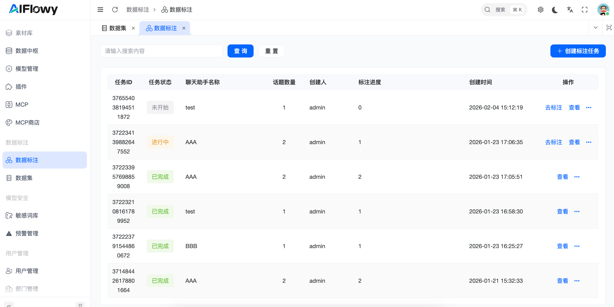
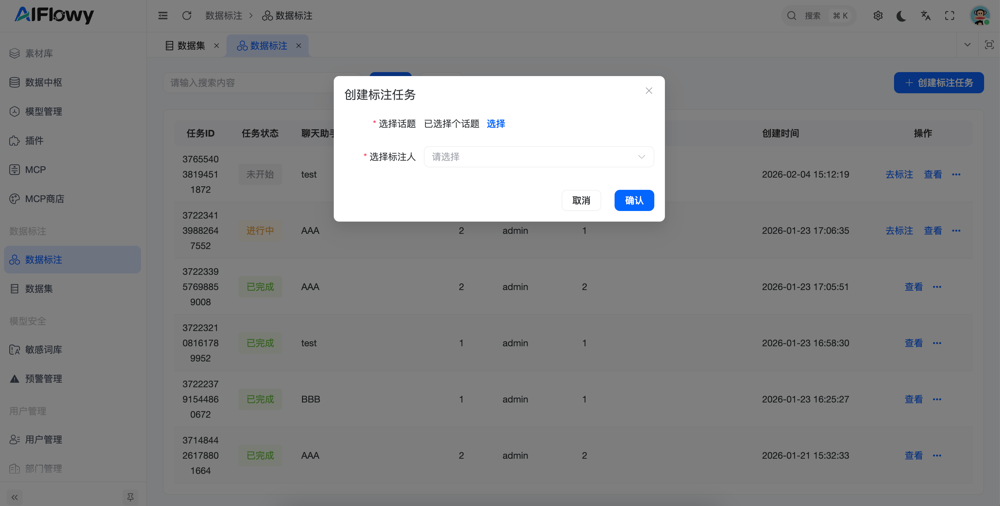
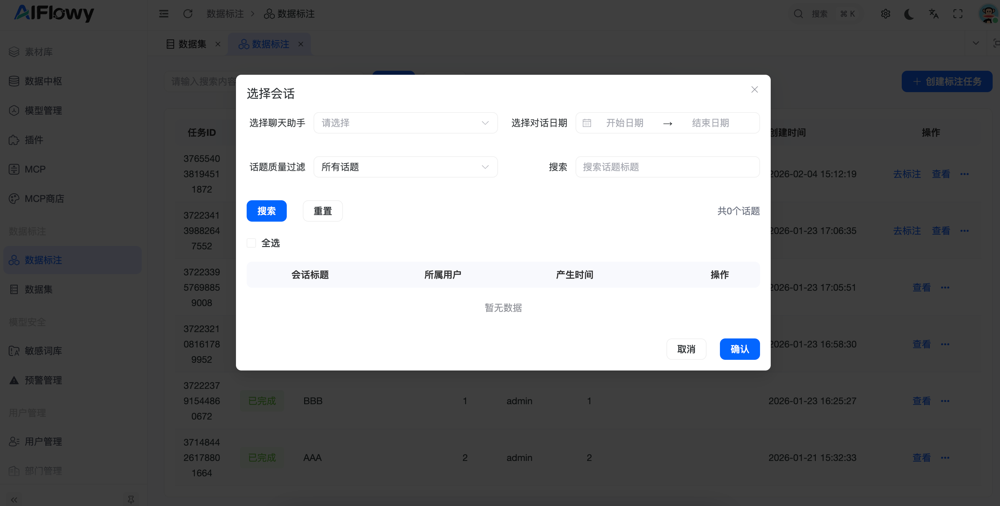
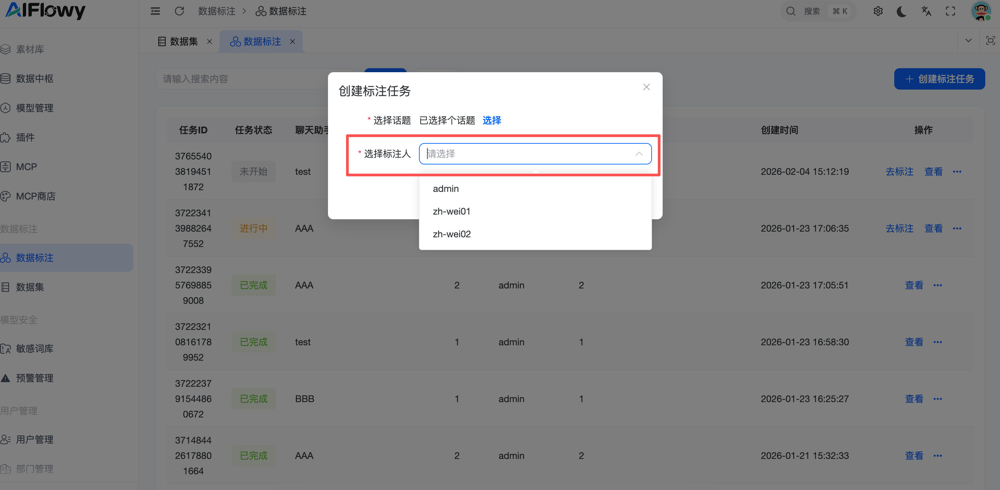
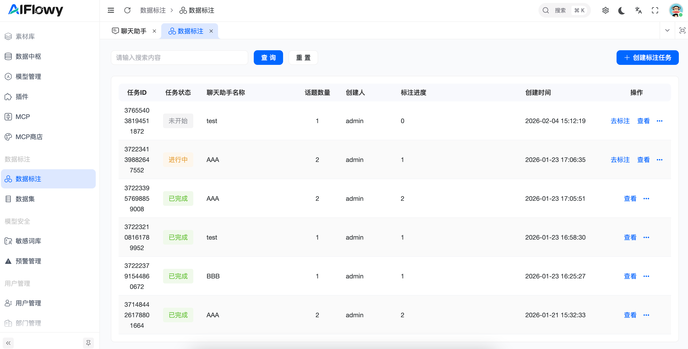
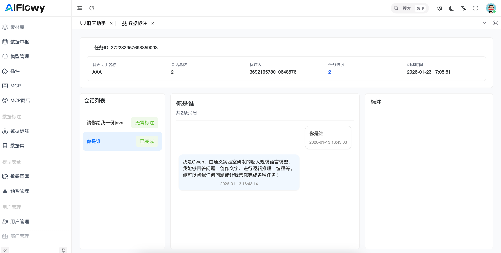
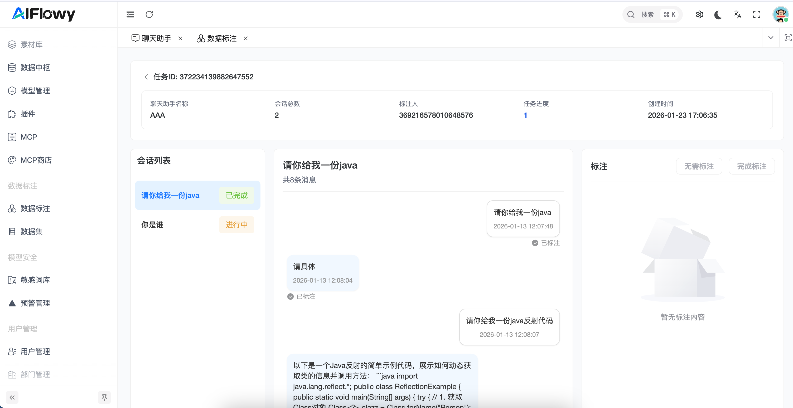
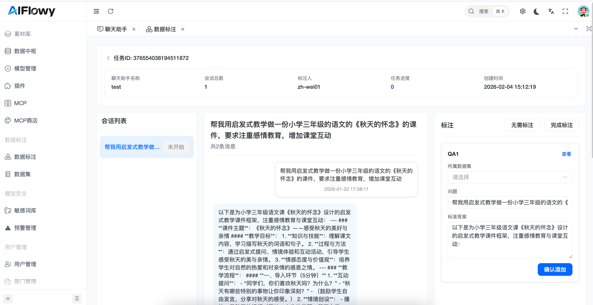
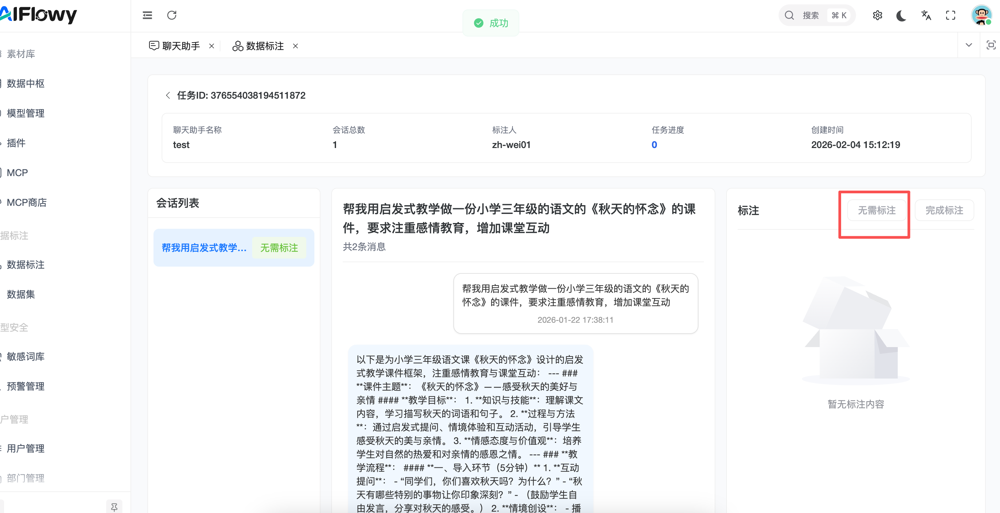

# 数据标注 

## 1. 功能概述

标注任务旨在通过人工回溯真实的对话记录，精准修复 AI 在实际运行中的错误或不足。

## 2. 核心功能操作指南

### 2.1 任务创建与分配（管理员）

**任务配置**：管理员点击 **创建标注任务**，选择目标聊天助手，并根据日期或话题质量过滤需要标注的会话。

**人员指派**：支持指派特定的标注人（如：张三、小红）负责该任务。

**进度监控**：在列表中实时显示任务状态（进行中 / 已完成 / 未开始）以及每个人的标注进度。

**任务列表详情**：点击查看进入列表页查看标注信息,可以查看标注的进度以及对话消息

### 2.2 对话标注流程（标注员）

* **会话预览**：标注员可预览原始对话详情，查看用户提问与系统回答的完整逻辑。

* **标注编辑**：

    * **选取对话**：在对话流中勾选需要转为 QA 的消息对。

     * **精修 QA**：在右侧标注编辑区修改问题和答案，并选择将其保存至目标数据集。保存至数据集后，管理员可以对QA进行审核。

    

   
* **状态处理**：对于无价值的对话，可标记为**无需标注**；处理完成后点击**完成标注**。

