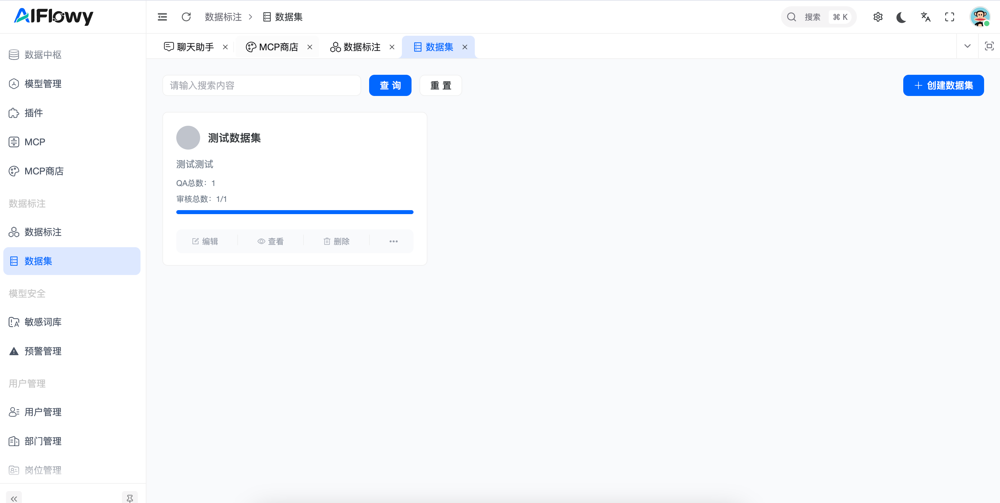
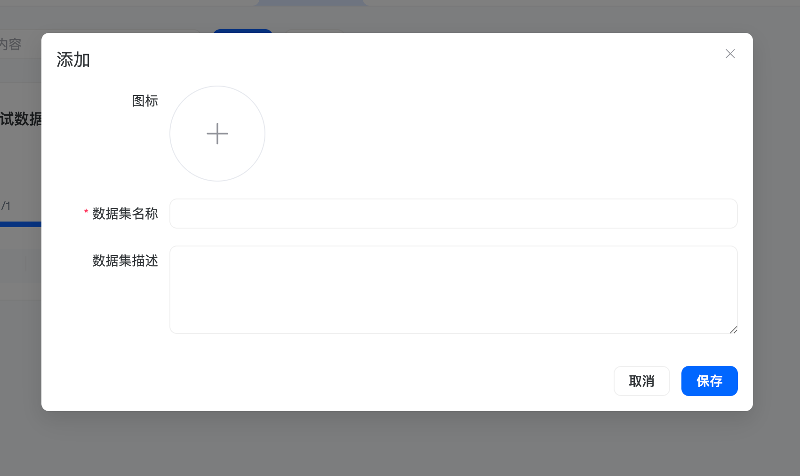
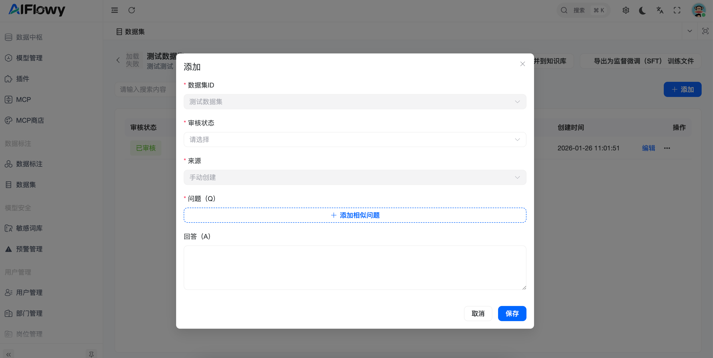
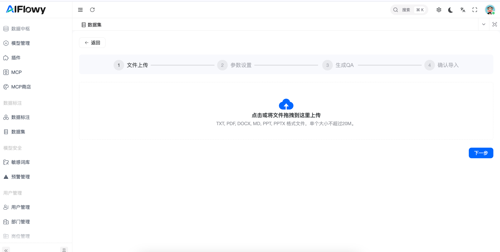
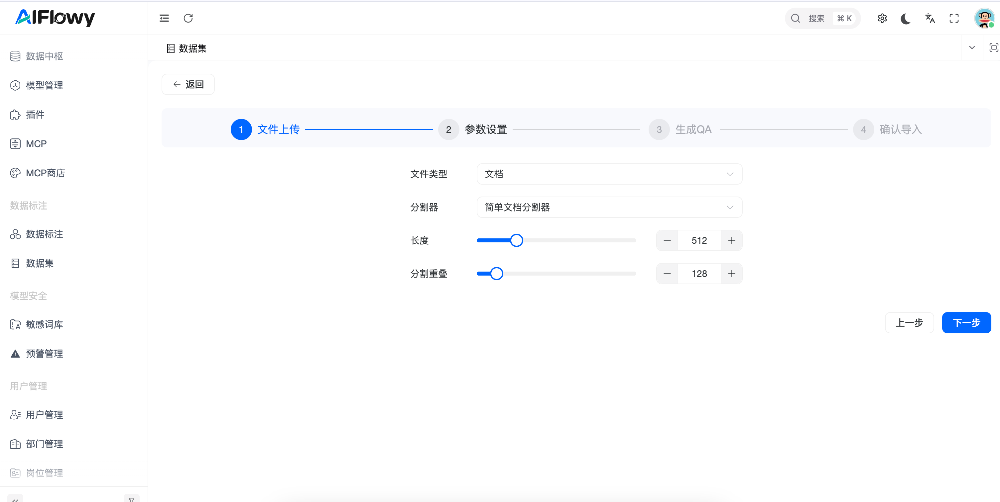
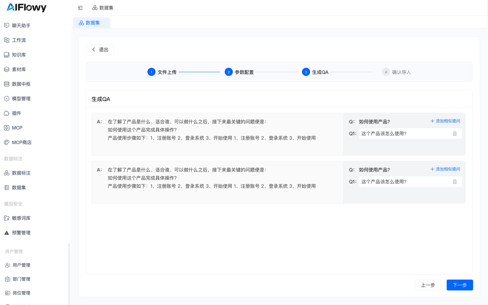
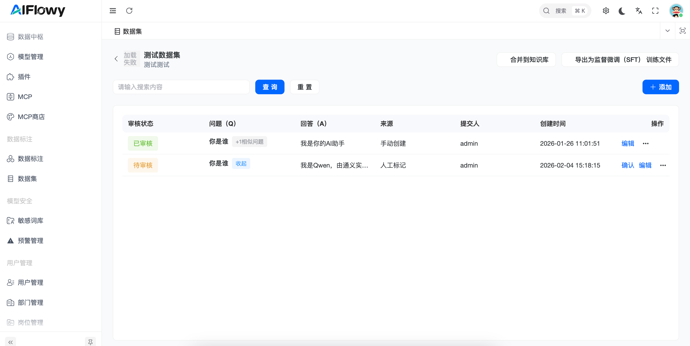
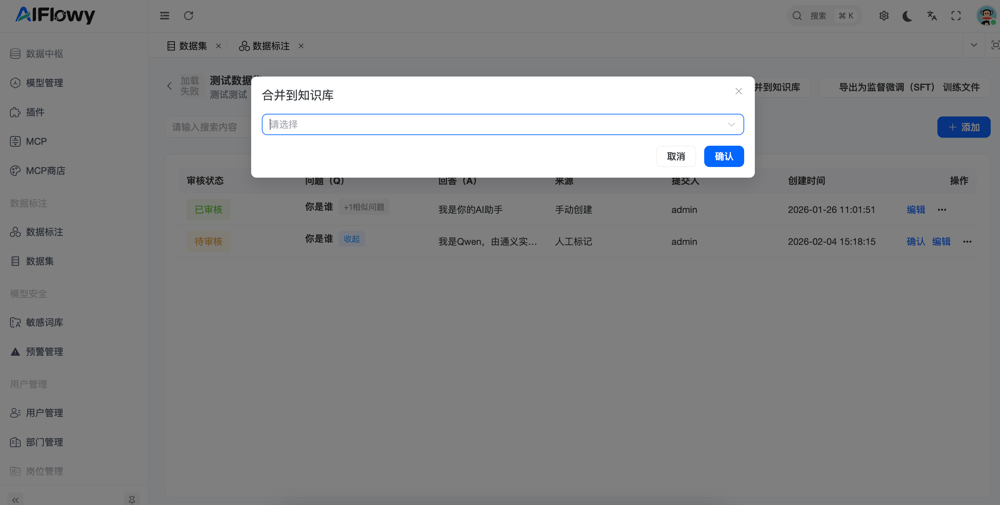

# 数据集
## 1. 功能概述
**数据集**是存放高质量问答对（QA）的容器，也是知识库数据的核心来源。

## 2. 核心功能操作指南

### 2.1 创建数据集  

操作入口：点击 **数据标注** 菜单下的 **数据集** ，进入看板页面。

看板信息：在看板可以直观查看各数据集的 QA 总数及审核进度条。

**创建数据集**

点击 **[创建数据集]** 按钮出现新建弹窗

图标：上传数据集标识。

名称：必填项，用于区分不同的业务领域。

描述：详细说明数据集的用途。

### 2.2 数据录入与详情管理
数据录入有两种方式：一种是手动创建QA，另一种是智能文档导入

[//]: # (![]&#40;resource/ScreenShot_2026-02-04_150914_297.png&#41;)

**1、手动创建 QA**：

用户需指定所属数据集，并设置审核状态（已审核/待审核）。

支持添加“标准问题”及多个“相似提问”，以增强模型的泛化匹配能力。

**2、智能文档导入**：

文件上传：支持 TXT、PDF、DOCX、MD 等多种格式，单文件上限 20MB。

**参数配置**：可调整分割器类型、分段长度及分割重叠度，以优化 AI 提取效果。

**QA生成**：系统基于文档自动提取 Q（问题）和 A（答案），可以添加相似提问。

### 2.3 审核与同步  

审核流：在详情页中，管理员可以对“AI 提取”或“任务导入”的内容进行编辑、删除或确认审核。

同步产出：点击右上角 **合并到知识库**，将已录入的高质量 QA 正式应用到知识库。

