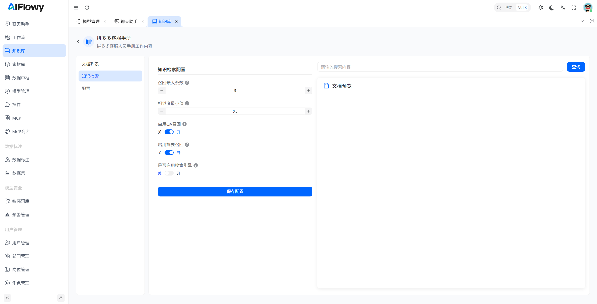
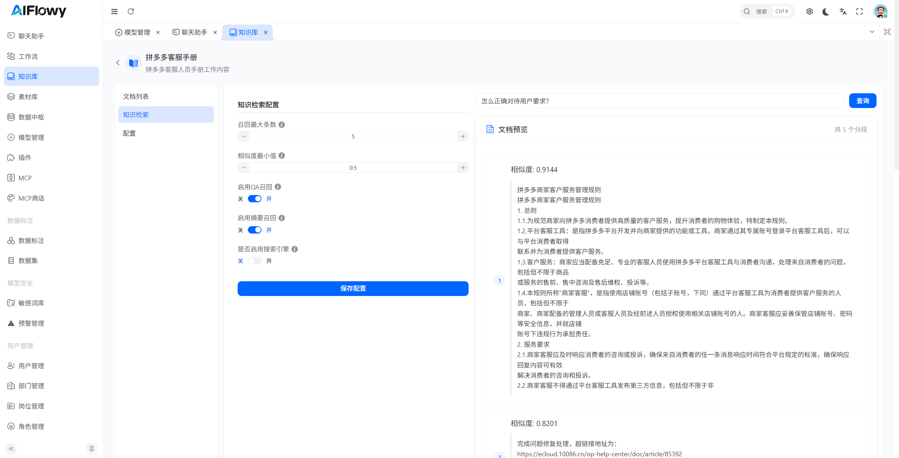

# 知识检索召回
1. 点击进入如图所示页面

## 一、页面定位
当前页面属于「知识库」模块下的**知识检索配置页**（以“拼多多客服手册”为例），可对指定知识库的检索参数、策略进行个性化设置，直接影响大模型检索该知识库时的结果准确性与覆盖度。

## 二、核心配置项说明
页面中间区域为「知识检索配置」面板，包含以下可配置参数：

| 配置项 | 说明 | 操作方式 |
|--------|------|----------|
| **召回最大条数** | 控制单次检索时，知识库返回的最大相关知识分段数量（当前默认值为5） | 通过“-”“+”按钮调整数值 |
| **相似度最小值** | 设定知识匹配的最低相似度阈值（当前默认值为0.5），低于该值的知识将不会被召回，用于过滤低相关度结果 | 通过“-”“+”按钮调整数值（范围通常为0-1） |
| **启用QA召回** | 开关控制是否启用「相似提问检索」策略（需先在知识分段中配置“相似提问”） 开启后，检索会优先匹配相似提问，未命中时再使用向量检索 | 点击“关/开”切换状态（当前为开启） |
| **启用摘要召回** | 开关控制是否启用「摘要检索」策略（需先在知识分段中配置“摘要”） 开启后，检索会结合知识分段的摘要内容进行匹配，提升语义相关性 | 点击“关/开”切换状态（当前为开启） |
| **是否启用搜索引擎** | 开关控制是否对接外部搜索引擎补充检索结果（通常为高级功能） | 点击“关/开”切换状态（当前为关闭） |

## 三、操作流程
1. 根据业务需求调整上述配置项的数值/开关状态；
2. 配置完成后，点击蓝色的**保存配置**按钮，使参数生效；
3. 可在右侧「文档预览」区域输入内容并点击**查询**，测试检索效果是否符合预期。

## 四、知识检索：

上图中是我针对某一个块的文档设置了 **相似提问** 和 **摘要**，测试结果如下：

## 五、功能价值
通过调整这些配置项，可灵活控制知识库的检索精度、召回范围，适配不同场景（如：需要精准回答时提高相似度阈值，需要覆盖更多内容时增加召回条数），结合“QA召回”“摘要召回”功能，进一步提升知识匹配的准确性与效率。