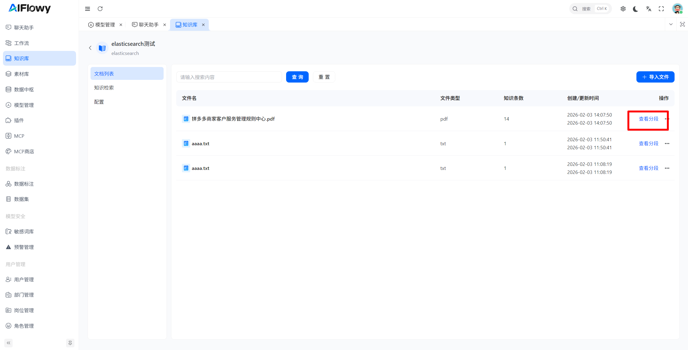
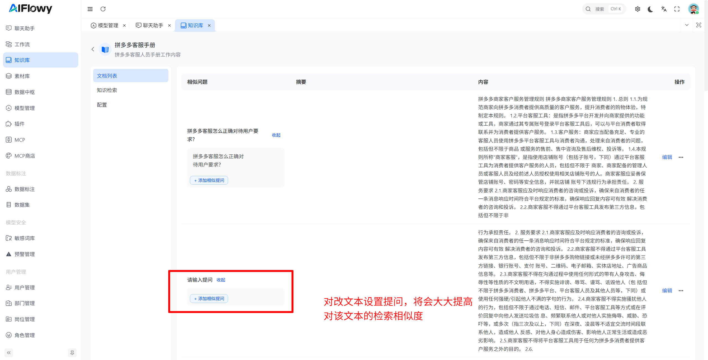
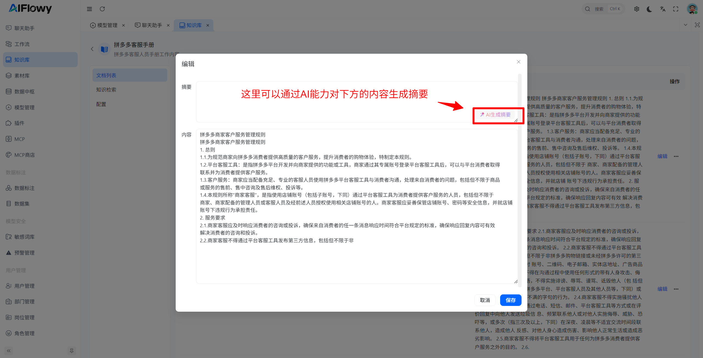
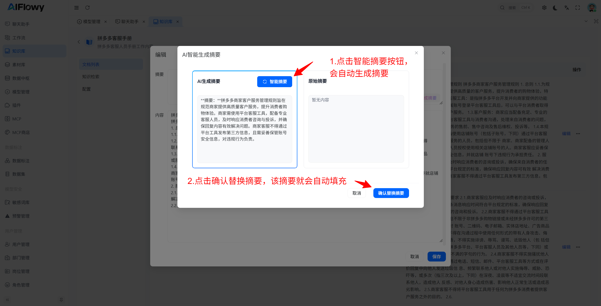
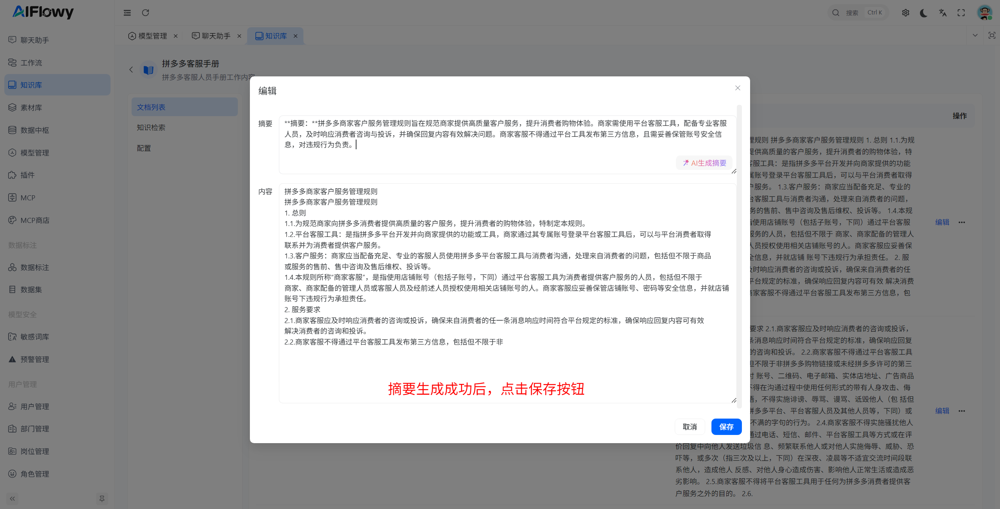

# 管理知识库

## 如何管理知识库
点击文档列表中的 **查看分段** 按钮，即可进入该文档的知识分段管理页面，对文档内的所有知识内容进行精细化管理。

1. **分段内容管理**
   在该页面中，你可以对已完成向量化处理的知识分段进行**预览、编辑、删除**等操作，实时管理知识库内容。

2. **内容修改与自动向量化**
   当你对知识分段的内容进行修改并保存后，系统会**自动对该分段重新进行向量化处理**，确保检索数据实时同步，无需手动重新构建索引。

3. **（商业版）相似提问配置**
   你可以为每个知识分段设置**相似提问**，用于模拟用户可能的问法，大幅提升检索召回率与匹配准确度。
   在使用 **QA 检索模式** 时，系统会**优先使用相似提问进行匹配**；若未命中结果，则自动 fallback 到向量检索，兼顾精准度与覆盖度。

4. **（商业版）摘要生成与配置**
   点击右侧 **编辑** 按钮，可为当前知识分段配置或生成**智能摘要**。
   摘要用于概括该分段的核心内容，能显著提升语义检索的召回能力与相关性，让大模型更快定位关键信息。
5. 

**摘要生成示例：**

确认内容后点击 **保存**，生成的摘要将自动存入知识库并参与后续检索与问答流程。

