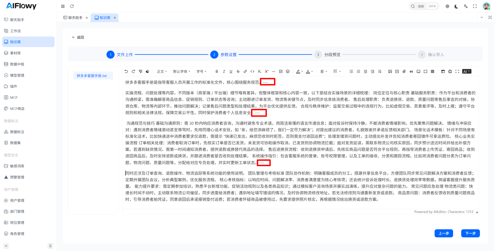
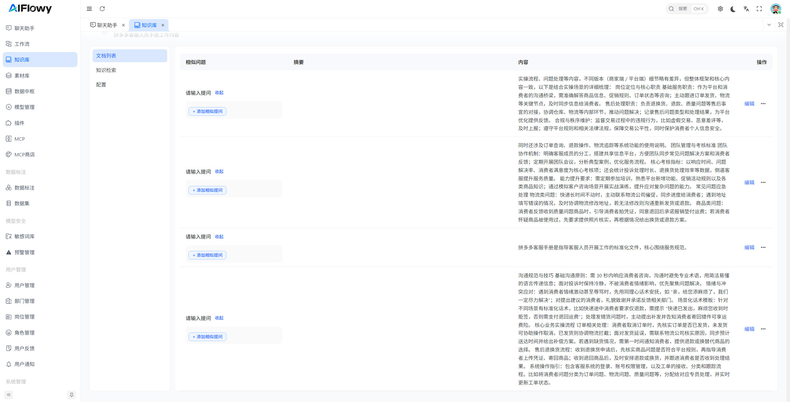

# 分割器介绍
## 手动分割策略（商业版）
基于用户自定义分隔符的分割器，完全按照用户的主观意图实现文档分割，适用于需要精准控制分割边界的场景。

### 核心特性
- 自定义分割：用户在文档任意位置插入指定分隔符，分割器按分隔符位置拆分内容
- 精准可控：分割边界完全由用户决定，适配各类特殊业务场景的分割需求
- 无长度/格式限制：分割结果仅依赖分隔符位置，不受文本长度、文档格式约束

### 核心参数说明
| 参数名 | 含义 | 作用 | 示例 |
|--------|------|------|------|
| 分隔符 | 用于触发分割的自定义字符/字符串 | 定义分割的边界标识 | 默认分隔符为`---`，用户在文档中插入`---`后，分割器会以此为界将文档拆分为多个片段 |
| 忽略空片段 | 是否过滤分割后产生的空内容片段 | 优化分割结果，避免无效片段 | 开启后，若分隔符连续出现或位于文档首尾，产生的空片段会被自动过滤 |

- 手动分割策略示例：

- 分割结果:

## 简单文档分割器
默认使用的基础分割器，将文本内容按字符长度进行连续分割，生成多个独立的文本片段（Chunks），适用于无结构化的纯文本内容处理。

### 核心特性
- 按字符长度（`String.length()`）进行机械分割，逻辑简单、处理高效
- 支持片段重叠配置，避免语义硬截断
- 无格式依赖，适配所有纯文本文档

| 参数名  | 含义 | 作用 | 示例                                                                  |
|------|------|------|---------------------------------------------------------------------|
| 分段策略 | 文本分割的执行方式，分为「自动分割」和「手动分割」 | 控制分割的核心逻辑，适配不同使用场景 | 自动分割：按字符长度规则拆分 手动分割：按用户插入的分隔符拆分,分隔符为 `---` **（商业版独有）**            |
| 分段长度 | （仅自动分割生效）每个文本片段的最大字符长度 | 控制单段文本大小，适配LLM上下文窗口限制 | 分段长度=500时，每个片段字符数≤500，剩余不足则直接截取                                     |
| 分段重叠 | （仅自动分割生效）相邻两个片段之间重叠的字符数 | 避免语义断裂，保持上下文连贯性 | 分段长度=500、分段重叠=100时： 第1段：0~500字符 第2段：400~900字符 第3段：800~1300字符 |

## 正则文档分割器
基于正则表达式（Regex）规则的智能分割器，通过自定义匹配模式实现内容的结构化拆分，特别适用于具有固定格式的文档处理。

### 核心特性
- 智能分割：根据用户自定义正则表达式匹配内容边界进行分割
- 灵活匹配：支持所有标准正则表达式语法（如换行、特定符号、固定格式等）
- 结构保留：完美适配日志文件、代码文本、配置文件等结构化文档
- 无长度限制：分割边界由正则匹配结果决定，非固定长度

## 简单分词器
专为大语言模型（LLM）输入优化的Token级分割器，解决字符数分割与模型Token数不匹配的问题。

### 核心特性
- 按Token数量（而非字符数）进行分割，精准适配LLM上下文限制
- 支持重叠分割，保持片段间上下文连贯
- 自动适配中文、Emoji等Unicode字符的Token计算规则
- 兼容OpenAI、Claude等主流模型的Token计数方式

### 核心参数说明
| 参数名 | 含义 |
|------|------|
| 分段长度 | 每个文本片段的最大Token数量 |
| 分段重叠 | 相邻两个片段之间重叠的Token数量 |

## MarkDown标题层级分割器
基于Markdown标题层级（`#`符号）的语义化分割器，按文档的标题结构实现逻辑单元拆分，适用于结构化的Markdown文档处理。

### 核心特性
- 语义化分割：以Markdown标题（#/##/###等）为分割边界，保留标题对应的完整内容块
- 层级可控：支持指定分割层级（如仅按一级标题分割、按二级标题分割等）
- 结构保留：分割后的每个片段包含对应标题及下属全部内容，保持文档逻辑完整性
- 无长度限制：分割边界由标题层级决定，单个片段为完整的标题逻辑单元

### 核心参数说明
| 参数名 | 含义 | 作用 | 示例                                                                            |
|--------|------|------|-------------------------------------------------------------------------------|
| Markdown标题等级 | 触发分割的标题层级（#到######） | 控制分割粒度，层级越小分割粒度越大 | 标题等级=#：仅按一级标题（#）分割，每个片段为一个一级标题下的全部内容 标题等级=##：按二级标题（##）分割，每个片段为一个二级标题下的全部内容 |

---