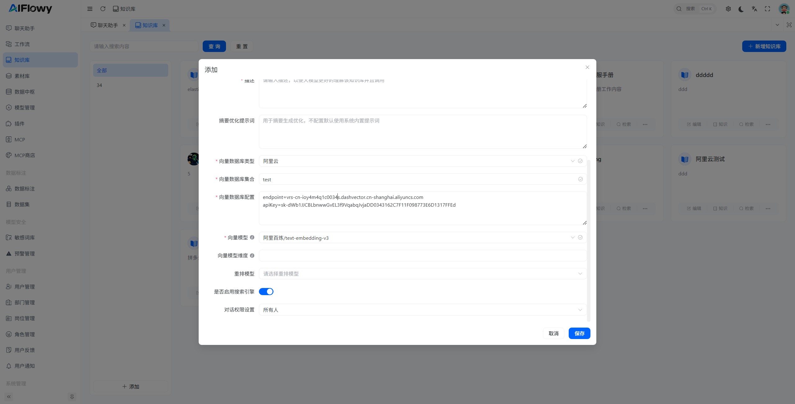

你希望我优化这份阿里云向量数据库的配置文档，让它的结构更清晰、步骤更易懂、关键信息更突出，同时补充必要的说明和注意事项，方便使用者一步步操作。

# 阿里云向量数据库（DashVector）配置及AIFlowy集成文档
## 一、文档说明
本文档详细介绍阿里云向量数据库（DashVector）的 Cluster/Collection 创建流程，以及如何将其配置到 AIFlowy 知识库中，最终实现文件导入和向量存储。
> 前置条件：已注册阿里云账号并开通 DashVector 向量数据库服务，已安装并可正常使用 AIFlowy。

## 二、阿里云向量数据库配置
### 1. 创建 Cluster（集群）
1. 打开阿里云向量数据库控制台：[https://dashvector.console.aliyun.com/](https://dashvector.console.aliyun.com/)
2. 按照页面指引点击「创建 Cluster」按钮，根据实际需求选择集群规格（测试环境可选低配），完成集群创建。
   > 参考截图：

### 2. 创建 Collection（集合）
Collection 是向量数据的存储单元，需匹配向量模型的维度，步骤如下：
1. 进入已创建的 Cluster 详情页，点击「创建 Collection」按钮。
   > 参考截图：
2. 配置 Collection 核心参数：
    - **集合名称**：自定义（示例：test），建议使用英文/数字，便于识别。
    - **向量维度**：需与使用的向量模型维度一致，步骤如下：
      ① 打开阿里云向量模型文档地址：[https://bailian.console.aliyun.com/?spm=5176.29597918.J_SEsSjsNv72yRuRFS2VknO.2.2fa47b08M1kJNB&tab=api#/api/?type=model&url=https%3A%2F%2Fhelp.aliyun.com%2Fdocument_detail%2F2712515.html](https://bailian.console.aliyun.com/?spm=5176.29597918.J_SEsSjsNv72yRuRFS2VknO.2.2fa47b08M1kJNB&tab=api#/api/?type=model&url=https%3A%2F%2Fhelp.aliyun.com%2Fdocument_detail%2F2712515.html)
      ② 找到使用的模型（示例：text-embedding-v3），查看其向量维度为 **1024维**，并填入配置项。
   > 参考截图：
3. 确认参数无误后点击「确定」，完成 Collection 创建。
   > 参考截图：
4. 创建完成后，可在 Cluster 下看到已创建的 Collection（示例：test）。
   > 参考截图：

### 3. 获取配置关键信息
配置 AIFlowy 需获取 3 个核心信息：Endpoint、集合名称、API Key，步骤如下：
#### （1）获取 Endpoint
1. 在 Collection 列表中，点击目标 Collection（示例：test）后的「详情」按钮。
   > 参考截图：
2. 在详情页复制「Endpoint」地址（后续配置 AIFlowy 需使用）。
   > 参考截图：

#### （2）获取 API Key
1. 打开 API Key 获取地址：[https://dashvector.console.aliyun.com/api-key](https://dashvector.console.aliyun.com/api-key)
2. 新建或选择已有 API Key，复制其值（注意：API Key 为敏感信息，请勿泄露）。
   > 参考截图：

#### （3）核心配置信息汇总
| 配置项 | 取值说明 |
|--------|----------|
| endpoint | 上述步骤复制的 Collection Endpoint |
| 集合名称 | 创建的 Collection 名称（示例：test） |
| apiKey | 上述步骤复制的 API Key |

## 三、AIFlowy 知识库配置
1. 打开 AIFlowy 系统，进入「知识库」模块，选择目标知识库（或新建知识库）。
2. 在知识库配置页，找到「向量数据库类型」配置项，选择「阿里云」。
3. 填入以下信息：
    - Endpoint：粘贴步骤 3.1 复制的地址。
    - 集合名称：填入创建的 Collection 名称（示例：test）。
    - API Key：粘贴步骤 3.2 复制的密钥。
   > 参考截图：
4. 保存配置，完成阿里云向量数据库与 AIFlowy 的关联。
