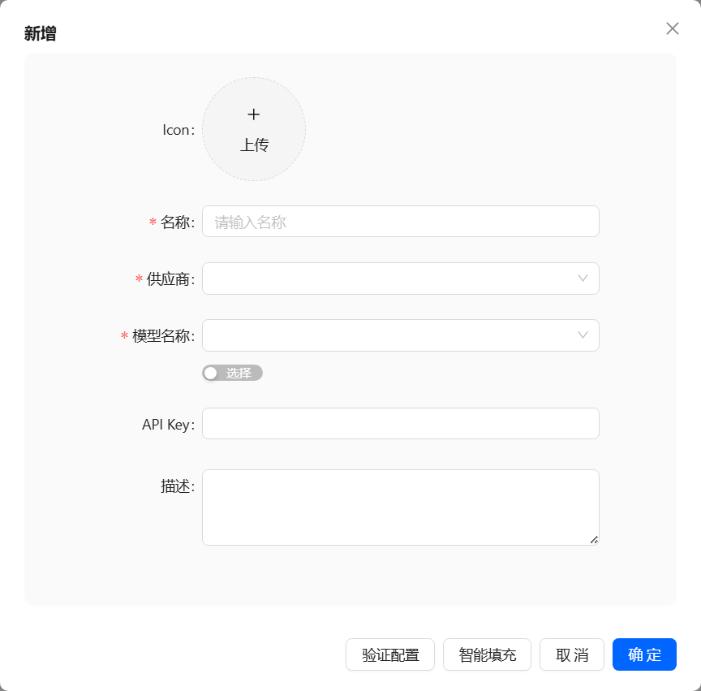
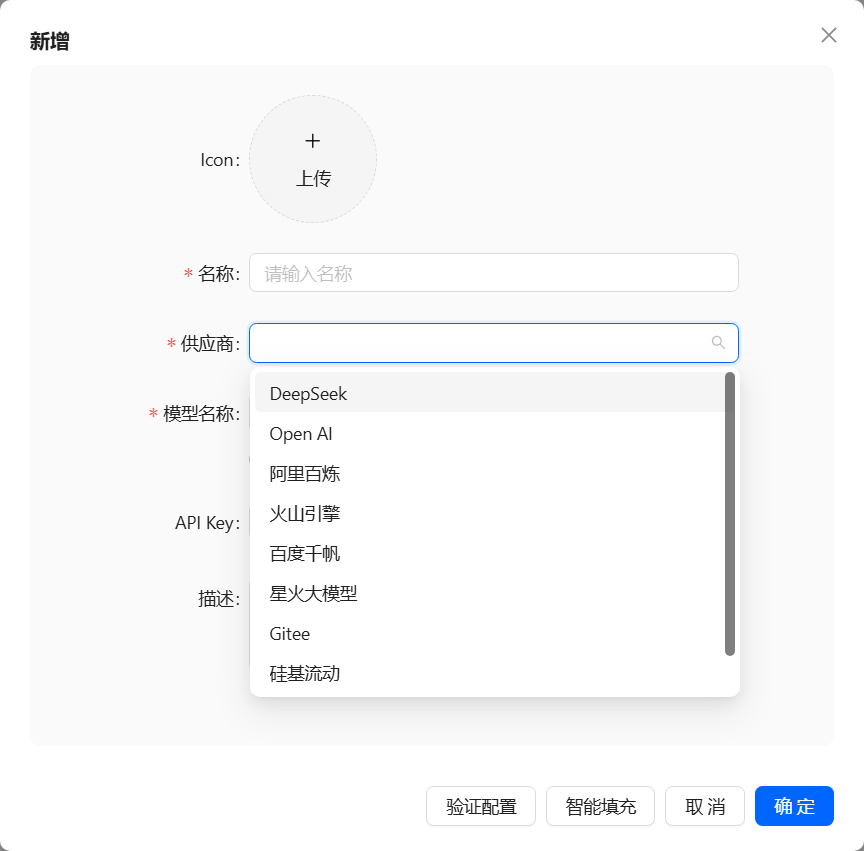
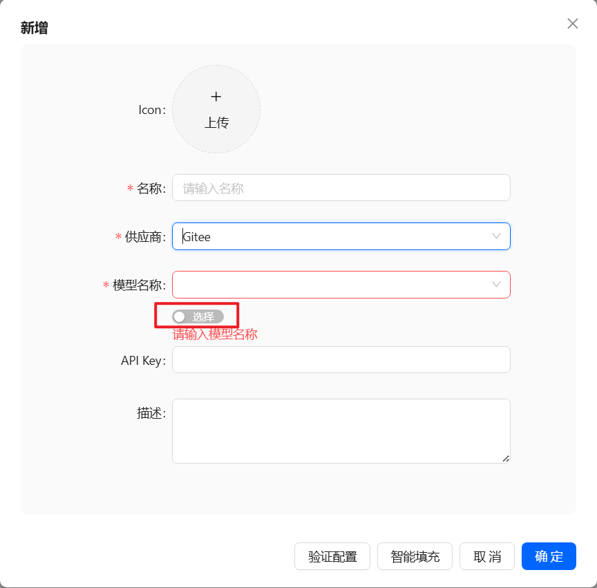
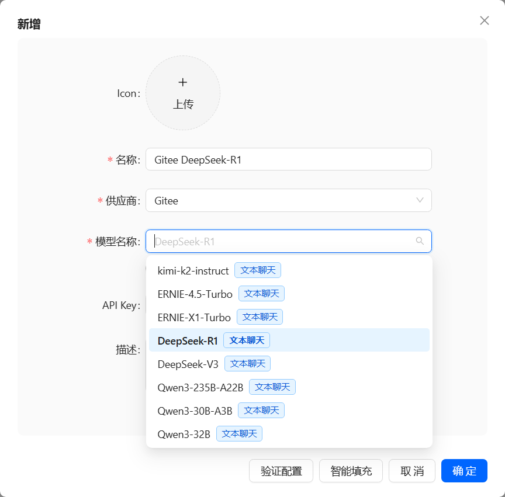
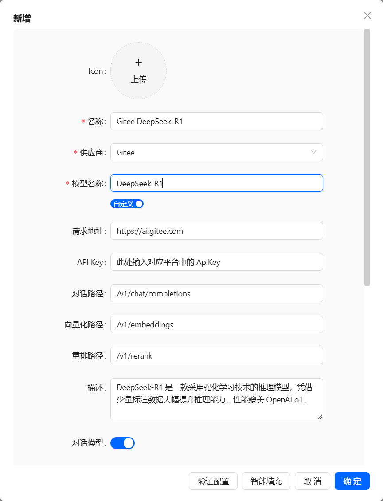
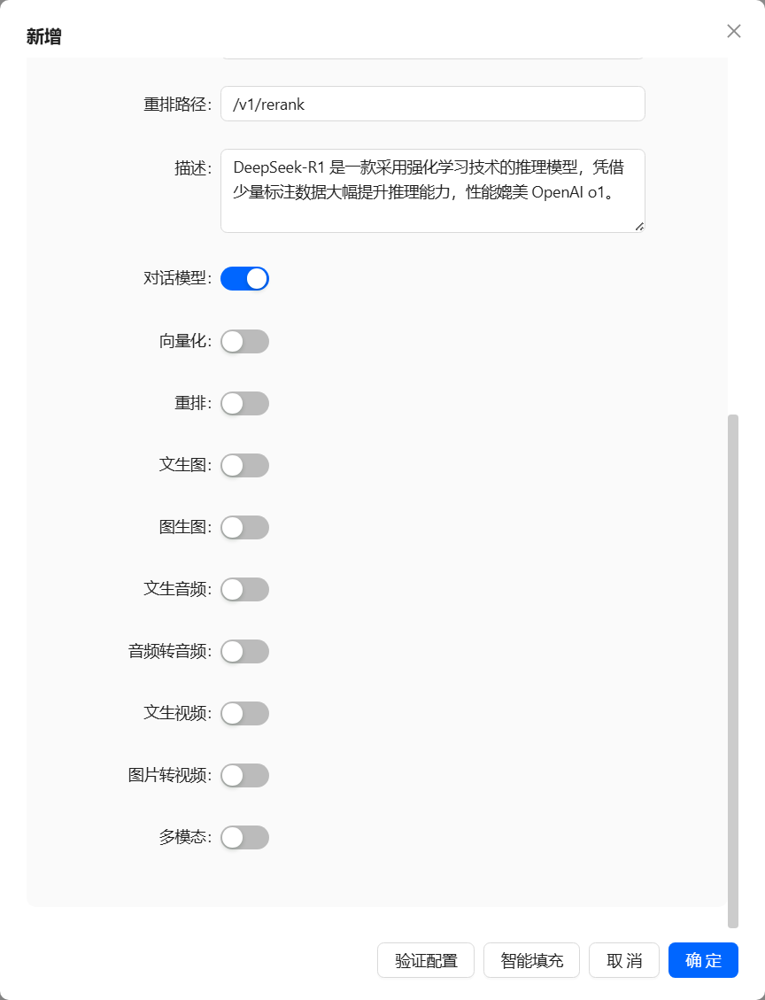

# 模型接入

## 添加大模型

点击`大模型`菜单项，进入模型管理界面后，点击右上角`新增大模型`按钮，弹出新增大模型弹窗

## 选择大模型供应商
点击供应商下拉，会弹出当前已支持供应商

## 选择/手动配置模型名称
选择供应商后，可以对模型名称进行配置，模型名称的配置支持选择系统内置的大模型，或者手动如如，通过模型名称下方的开关进行切换

###  选择系统内置的大模型

###  手动输入模型名称

###  手动输入模型名称，还需要在弹窗中将滚动条滚动到底部勾选对应能力

> 手动配置模型名称时，可以对大模型进行全量配置，例如 `聊天路径`、`向量化路径`、`重排路径`，通常在选择非`openAi`平台时，无需对这几个路径进行配置，使用默认值即可。
> 
> 若需要配置的平台，在系统内置的平台找不到，且该平台的 api 兼容了 openAi ，那么可以将供应商选择为 openAi ，自行配置聊天路径、向量化路径、重排路径（取决于你正在配置什么大模型）
## 大模型配置验证
添加/修改大模型配置时，可以点击弹窗底部的“验证配置”按钮，进行大模型配置正确性的验证。通常带深度思考功能的大模型，验证时间会略久于其他大模型。

