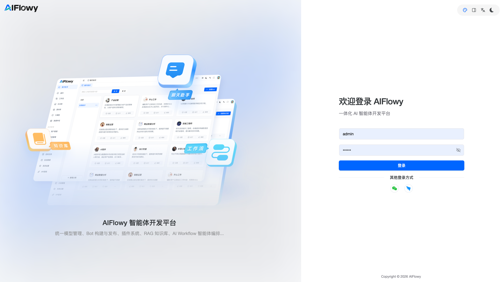

# AIFlowy 登录指南

欢迎使用 AIFlowy 一体化 AI 智能体开发平台！本指南将引导您完成首次登录或重新登录的全过程，确保您能快速、安全地进入平台，开始您的智能体开发之旅。

## 1. 访问登录页面

请在您的浏览器地址栏中输入 AIFlowy 平台的官方网址，或通过公司内部链接访问。成功加载后，您将看到如下所示的登录界面：

*   **左侧**：展示平台的核心功能预览图，包括“聊天助手”、“知识库”和“工作流”等模块。
*   **右侧**：是主要的登录表单区域，包含标题、用户名/密码输入框、登录按钮及其他登录选项。

## 2. 输入您的账户信息

在右侧的登录表单中，请按以下步骤操作：

1.  **用户名 (Username)**：
    *   在第一个输入框中，输入您的 AIFlowy 账户用户名。例如，图示中的默认值为 `admin`。
    *   请务必输入系统管理员为您分配或您自己注册时设定的准确用户名。

2.  **密码 (Password)**：
    *   在第二个输入框中，输入与您用户名对应的密码。
    *   为了保护您的账户安全，密码在输入时会以星号（`••••••`）的形式显示，不会明文可见。
    *   如果您忘记了密码，请联系您的系统管理员或参考平台提供的“忘记密码”功能（如果可用）。

3.  **显示/隐藏密码**：
    *   在密码输入框的右侧，有一个眼睛图标（👁️）。点击该图标可以切换密码的显示状态，方便您核对输入内容是否正确。

> **注意**：默认账号和密码分别是： admin / 123456，登录后，建议修改密码。

## 3. 执行登录操作

在确认用户名和密码无误后，进行登录：

*   点击蓝色的 **“登录”** 按钮。
*   系统将验证您的凭证。如果信息正确，您将被自动重定向至 AIFlowy 平台的主控制台或仪表盘。
*   如果登录失败（如用户名或密码错误），系统通常会在页面上显示错误提示，请根据提示修改信息后重试。

## 4. 其他登录方式

AIFlowy 平台可能支持多种登录方式，以适应不同的企业环境和用户习惯。

*   在“登录”按钮下方，您会看到一个名为 **“其他登录方式”** 的区域。
*   该区域目前展示了两个图标：
    *   **微信图标**：表示您可以使用微信账号进行扫码或授权登录。
    *   **飞书图标**：表示您可以使用飞书账号进行扫码或授权登录。
*   请点击您希望使用的第三方平台图标，按照弹出的指引完成授权流程即可登录。

## 5. 页面顶部功能区

在登录页面的右上角，您可以看到一些全局设置选项：

*   **主题切换**：最右侧的月亮图标（🌙）用于切换深色模式和浅色模式。
*   **语言切换**：中间的 “文A” 图标通常用于切换平台的显示语言。
*   **布局调整**：中间的方块图标（□）可能用于调整页面布局或视图模式。

**祝您使用愉快！**

如果您在登录过程中遇到任何问题，请及时联系您的系统管理员或 AIFlowy 官方客服支持团队。