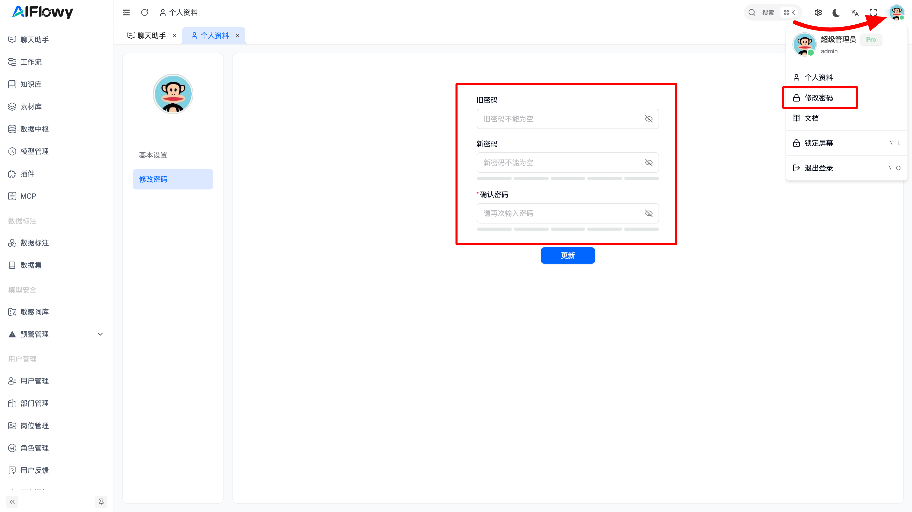

# 修改密码

为了保障您的账户安全，我们强烈建议您在首次登录后立即修改系统默认密码（`admin` / `123456`）。本章节将指导您如何在 AIFlowy 平台内安全、便捷地更改您的登录密码。

## 1. 进入“修改密码”页面

您可以通过以下两种方式快速进入密码修改界面：

### 通过顶部用户菜单（推荐）
1.  登录成功后，在页面右上角找到并点击您的用户头像。
2.  在弹出的下拉菜单中，点击 **“修改密码”** 选项。
    *   该选项图标为一个锁形符号（🔒），旁边标有“修改密码”文字。

## 2. 填写密码修改表单

在“修改密码”页面，您需要填写三个关键字段：

1.  **旧密码 (Current Password)**：
    *   输入您当前正在使用的密码。例如，如果您是首次登录，这里应输入默认密码 `123456`。
    *   此字段为必填项，用于验证您的身份。

2.  **新密码 (New Password)**：
    *   输入您希望设置的新密码。
    *   新密码应具备一定的复杂度，建议包含大小写字母、数字和特殊字符，以增强安全性。
    *   此字段为必填项。

3.  **确认密码 (Confirm New Password)**：
    *   再次输入您刚刚设置的“新密码”，以确保两次输入完全一致，避免因误操作导致密码错误。
    *   此字段为必填项，且必须与“新密码”字段内容完全相同。

### 密码可见性切换
*   每个密码输入框的右侧都有一个眼睛图标（👁️）。
*   点击该图标可以临时显示或隐藏您输入的密码，方便您核对内容是否准确无误。

## 3. 提交并更新密码

在确认所有信息填写无误后，请执行以下操作：

*   点击页面下方的蓝色 **“更新”** 按钮。
*   系统将进行校验：
    *   如果旧密码正确，且新密码与确认密码一致，系统将成功更新您的密码，并通常会弹出“修改成功”的提示。
    *   如果任何一项校验失败（如旧密码错误、新密码为空、两次新密码不一致等），系统会在相应字段下方显示红色错误提示，请根据提示修正后重新提交。

## 4. 安全提醒

*   **请务必记住新密码**：修改成功后，下次登录时需使用新密码。
*   **不要泄露密码**：切勿将您的密码告知他人，或在公共电脑上保存密码。
*   **定期更换密码**：为保障账户安全，建议您每隔一段时间（如3个月）主动修改一次密码。

完成以上步骤，您的账户密码就已成功更新！现在您可以放心地使用 AIFlowy 平台进行各项智能体开发工作了。