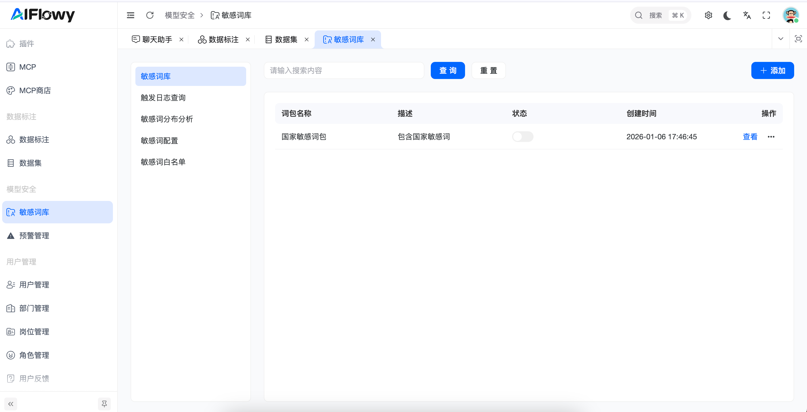
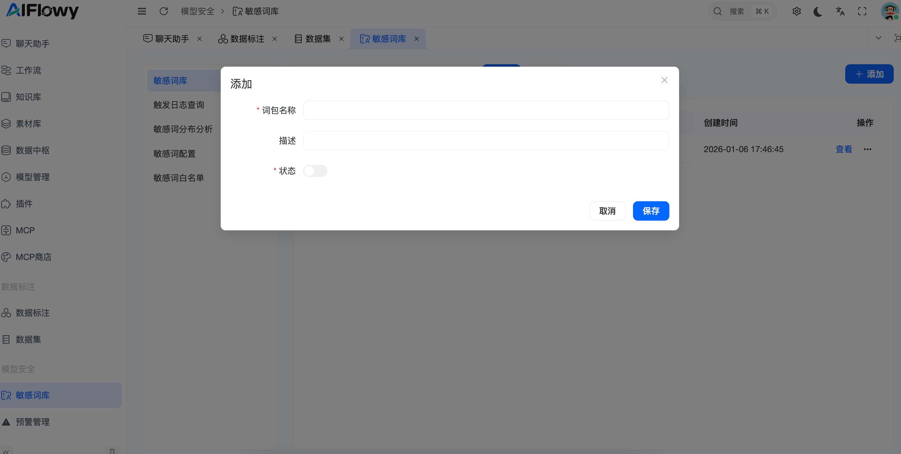
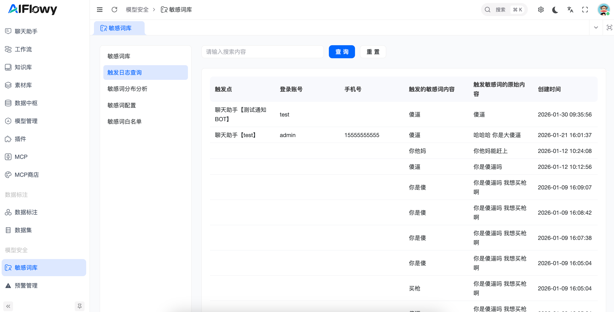
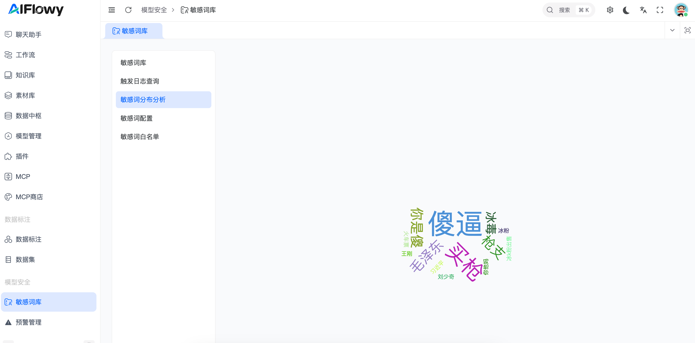
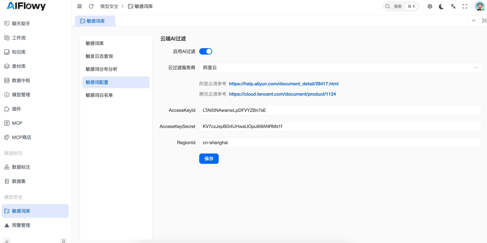
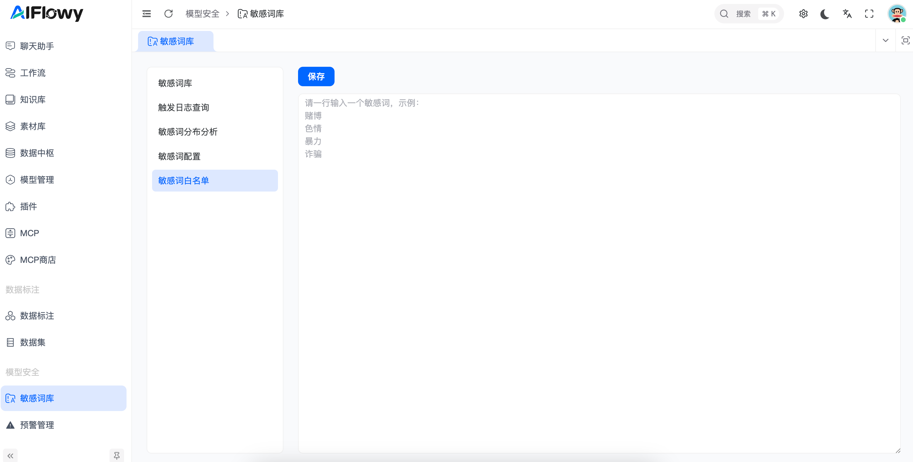

# 敏感词库

## 1. 功能概述

AIFlowy 敏感词库是为 AI 应用量身定制的安全屏障。它支持本地自定义词库与云端 AI 深度过滤双重机制，帮助管理员实时监控、拦截并分析用户输入中的违规信息。

## 2. 核心功能操作指南

### 2.1 词库管理

这是管理安全策略的基础单元。你可以根据业务需求（如：政治敏感、色情低俗、暴恐违禁）创建不同的词包。

**查看词包列表**：查看词包名称、描述、启用状态及创建时间。

**快捷开关**：在列表页直接通过开关切换词包的生效状态。

**新增词包**：点击右上角“添加”按钮，在弹窗中填写必要信息。

**词包名称**：建议按分类命名。

**状态**：开启或关闭。

### 2.1 触发日志查询

系统会实时记录所有命中词库的用户行为，这是进行安全审计和用户画像分析的重要依据。

**多维度追踪**：记录触发点（具体哪个机器人）、用户信息（账号/手机号）、触发词以及原始完整输入。

**语境分析**：通过查看“触发原始内容”，管理员可以判断用户是无意触发还是恶意绕过。

### 2.3 敏感词分布分析

通过词云图直观展示当前最活跃的敏感词汇，帮助你一眼看穿当前的违规热点。

**词云展示**：字体越大，代表该词在近期被触发的次数越多。

**趋势把控**：定期检查词云，可以帮助管理员针对性地更新加固本地词库。

### 2.4 敏感词配置

除了关键词匹配，系统支持接入主流云厂商（阿里云、腾讯云）的内容安全 API，识别隐晦的违规语义。

**配置步骤**：

开启“启用 AI 过滤”开关。

选择云过滤服务商。

填入对应的 AccessKeyId、AccessKeySecret 及 RegionId。

### 2.5 敏感词白名单（误报修复）

为了防止系统过度拦截影响用户体验，你可以将某些在特定语境下合法的词汇加入白名单。

**批量录入**：支持一行一个敏感词进行快速保存。

**优先级**：白名单中的词汇将跳过拦截逻辑，直接放行。

