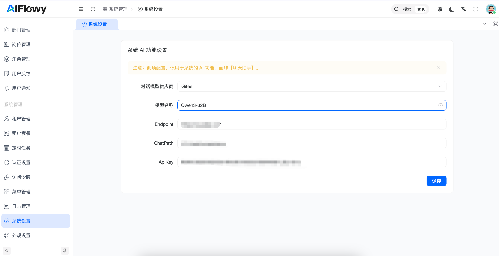

# 系统设置 (System Settings)

## 1. 功能概述
**系统设置** 模块是 AIFlowy 平台的底层核心配置中心。管理员在此处配置的 AI 模型参数将直接支撑整个系统的原生 AI 功能
> **注意**：此项配置仅用于平台的**内置系统级 AI 功能**，而非用户在【聊天助手】前端交互时使用的业务模型。

## 2. 核心功能操作指南

### 2.1 系统 AI 功能设置
在此界面，管理员需要对接主流的模型供应商，以为平台注入智能动力。

#### **关键字段配置说明**：
* **对话模型供应商**：选择当前系统对接的服务商（如：Gitee、OpenAI 等）。
* **模型名称**：指定具体的模型版本（例如：`Qwen3-32B`）。
* **Endpoint**：模型服务的 API 基础地址（例如：`https://ai.gitee.com`）。
* **ChatPath**：具体的对话接口路径（例如：`/v1/chat/completions`）。
* **ApiKey**：用于身份验证的机密密钥，确保请求的安全授权。

## 3. 操作流程示例：如何更新系统底层模型？

1. **进入模块**：在左侧导航栏的“系统管理”分类下，点击进入“系统设置”。
2. **填写参数**：根据供应商提供的技术文档，准确填入 `Endpoint` 和对应的 `ApiKey`。
3. **选择模型**：在“模型名称”处输入或选择性能更优的新版本模型。
4. **保存生效**：点击右下角的 **[保存]** 按钮。系统将立即应用新的模型配置来处理后台 AI 任务。

## 4. 注意事项
* **配置隔离**：请务必区分“系统级模型”与“业务级模型”。若您需要调整机器人助手的回答模型，请前往【模型管理】或具体助手的配置页。
* **安全性**：`ApiKey` 属于高敏感信息，保存后请勿随意泄露。
* **连通性校验**：建议在保存配置后，测试一下系统自带的辅助功能（如知识库自动摘要），以确保 API 路径及 Key 的正确性。