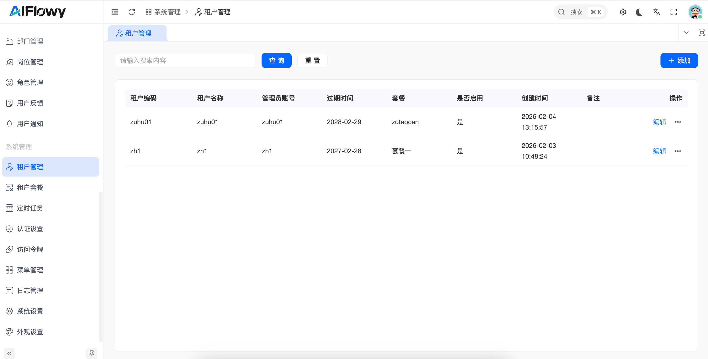
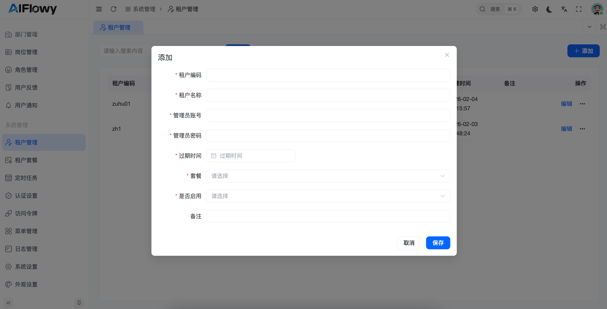
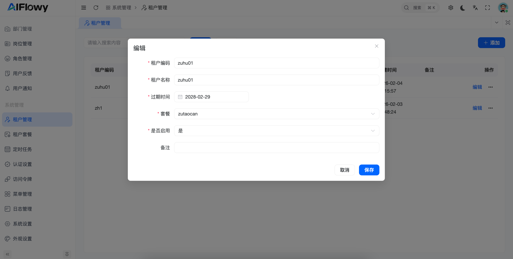

# 租户管理

## 1. 功能概述
**租户管理** 是 AIFlowy 平台面向多租户架构的核心管理模块。管理员可以通过该功能实现对不同企业或组织（租户）的隔离管理，包括账号开通、套餐分配、有效期控制以及状态监控，确保平台资源的高效分配与安全隔离。

## 2. 核心功能操作指南

### 2.1 租户列表概览
在租户管理主页面，您可以全局查看所有已入驻租户的核心信息。

* **信息维度**：
    * **租户编码/名称**：租户的唯一标识与展示名称。
    * **管理员账号**：该租户对应的顶级管理账号。
    * **过期时间**：租户服务的有效期截止日。
    * **套餐类型**：该租户关联的服务等级（如：标准套餐、高级套餐）。
    * **启用状态**：通过状态标签直观查看租户当前是否具备访问权限。
* **快捷检索**：支持通过租户名称或编码进行快速模糊查询。

### 2.2 新增租户入驻

点击页面右上角的 **[+ 添加]** 按钮，为新客户开通平台权限。

#### **关键字段配置说明**：
* **租户编码/名称 (必填)**：定义租户在系统中的唯一 ID 和识别名称。
* **管理员信息 (必填)**：
    * **管理员账号**：为该租户设置首个超级管理员账号。
    * **管理员密码**：设置该账号的初始登录密码。
* **服务周期**：
    * **过期时间**：通过日历控件选择服务到期日。
* **权限分配**：
    * **套餐**：从下拉列表中选择预设的权限套装（控制租户可使用的功能范围）。
    * **是否启用**：控制该租户账号在保存后是否立即生效。
* **备注**：记录租户的背景信息或合同编号等补充说明。

### 2.3 租户信息维护

对于已存在的租户，管理员可以随时调整其服务内容。

* **编辑操作**：点击列表右侧的 **[编辑]** 按钮。
* **变更范围**：
    * 延长或缩短**过期时间**。
    * 升级或降级租户绑定的**套餐**。
    * 临时禁用（置为“否”）违规或欠费租户的**启用状态**。

## 3. 操作流程示例：如何为租户续费？

1. **定位租户**：在搜索框输入租户名称，找到目标记录。
2. **打开编辑**：点击操作栏的“编辑”。
3. **调整时间**：在“过期时间”字段选择新的截止日期。
4. **确认保存**：点击“保存”按钮，续费立即生效，租户侧无感完成权限延续。