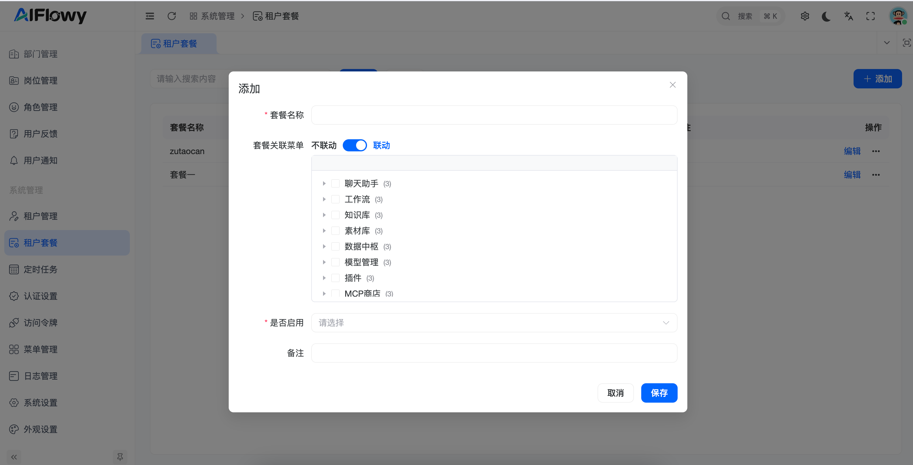
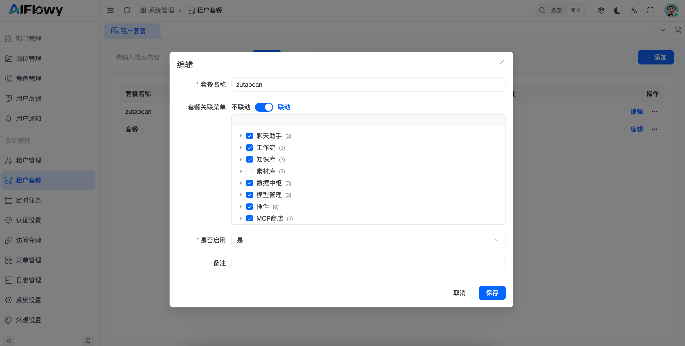

# 租户套餐

## 1. 功能概述
**租户套餐** 用于定义不同服务等级所对应的功能权限集合。通过套餐机制，管理员可以实现“一次配置，多租户复用”的高效管理模式，灵活控制不同租户可使用的功能范围。

## 2. 核心功能操作指南

### 2.1 套餐列表管理
在租户套餐主页面，您可以查看系统当前定义的所有套餐及其状态。

* **列表信息**：包括套餐名称、是否启用、创建时间及备注。
* **快捷操作**：支持对现有套餐进行“编辑”或通过“添加”按钮创建新规格。

### 2.2 新增与配置套餐
点击右上角 **[+ 添加]** 按钮，进入套餐定义弹窗。

#### **关键配置项解析**：
* **套餐名称 (必填)**：定义套餐的唯一识别名称（如：标准版、高级版、VIP套餐）。
* **套餐关联菜单 (核心配置)**：
    * 通过树状勾选框，精细化分配该套餐包含的功能模块。
    * 可选模块涵盖：**聊天助手、工作流、知识库、素材库、数据中枢、模型管理、插件及 MCP 商店**等。
* **联动机制**：
    * **不联动**：手动独立勾选每一级菜单。
    * **联动**：开启后，选中子功能将自动选中所属的父级菜单，确保权限逻辑完整。
* **是否启用**：控制该套餐当前是否可被分配给租户。

### 2.3 编辑与权限调整
点击操作栏的 **[编辑]** 按钮，可以随时更新套餐包含的功能。

* **实时生效**：修改套餐关联的菜单后，所有绑定该套餐的租户权限将同步更新。
* **权限预览**：在编辑界面可以清晰查看当前已选中的功能节点。

