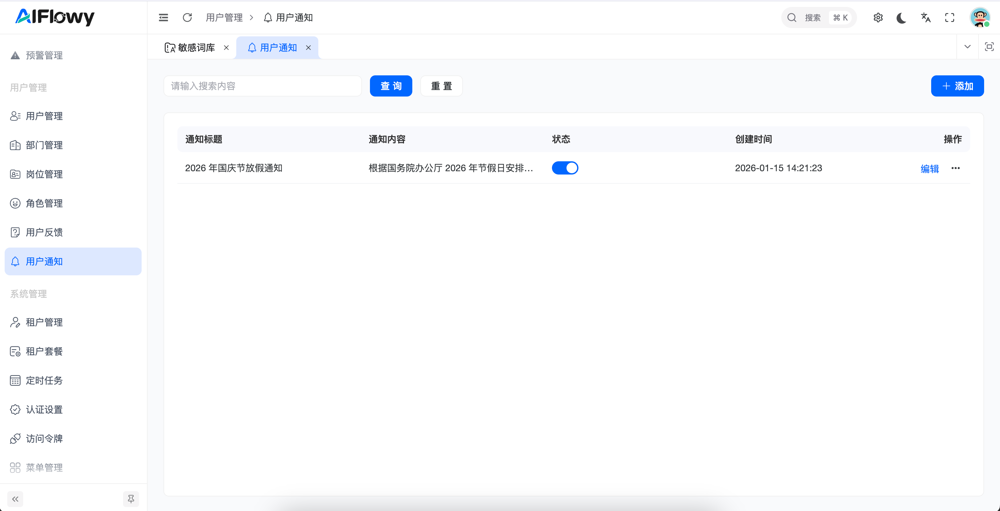
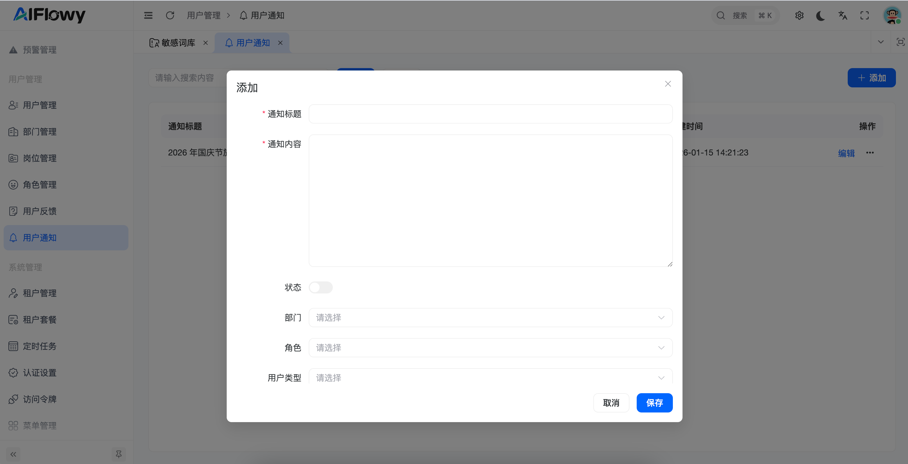
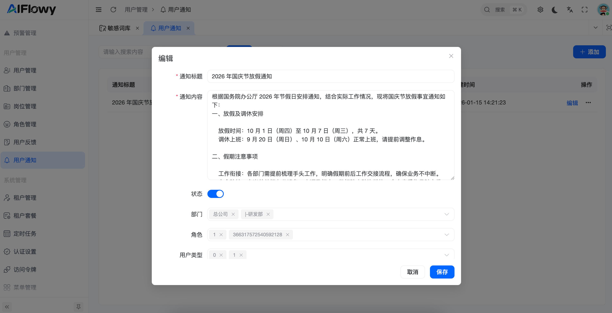

# 用户通知

## 1. 功能概述
**用户通知** 模块是 AIFlowy 平台信息传递的核心。管理员可以通过该功能发布系统公告、放假通知或业务提醒。系统支持按 **部门、角色、用户类型** 进行精准定向投递，确保信息传达到位。

## 2. 核心功能操作指南

### 2.1 通知列表管理

在用户通知主页面，您可以全局预览所有已发布的通知状态。

* **通知查询**：支持通过关键词搜索通知内容，快速定位历史记录。
* **列表字段说明**：
    * **通知标题**：简述通知的主题。
    * **通知内容**：展示通知的具体详细信息。
    * **状态开关**：一键控制通知的启用或失效状态。
    * **创建时间**：记录通知发布的精确时间点。
* **快捷操作**：支持对现有通知进行“编辑”或查看更多操作。

### 2.2 发布与编辑通知

点击页面右上角的 **[+ 添加]** 按钮，可进入通知发布弹窗进行详细配置。

#### **关键配置项解析**：
* **通知标题 (必填)**：设置清晰醒目的标题。
* **通知内容 (必填)**：支持多行文本输入，详细描述需要传达的信息。
* **状态**：设置发布后是否立即对目标用户可见。
* **定向投递 (精准推送)**：
    * **部门**：选择特定的部门（如：研发部、市场部）接收通知。
    * **角色**：根据用户角色（如：管理员、普通员工）进行筛选。
    * **用户类型**：按用户属性进行最后一道过滤。

### 2.3 操作示例：发布节假日通知

1. **进入模块**：在左侧菜单栏“用户管理”下选择“用户通知”。
2. **点击添加**：点击右上角蓝色的“添加”按钮。
3. **填写内容**：输入标题（如“2026年国庆节放假通知”）并填写详细安排。
4. **设置受众**：若仅针对特定群体，请在“部门”或“角色”下拉框中进行勾选。
5. **保存发布**：点击“保存”，通知将根据状态设定立即生效。

