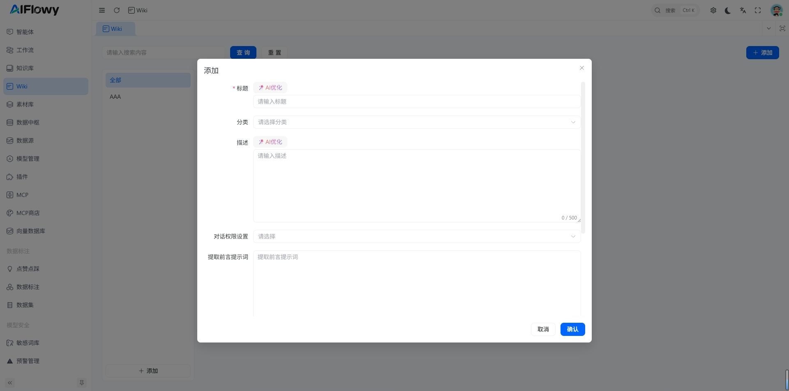

# 一、什么是 Wiki

Wiki 是 AIFlowy 提供的结构化知识管理功能,支持目录层级管理和文档内容查看，适合用于构建企业内部知识库、产品文档、操作手册等。

## 1.1 与知识库的区别

| 特性 | Wiki(知识管理) | 知识库(Document Collection) |
|-----|---------------|---------------------------|
| 数据结构 | 结构化的目录和文档 | 非结构化的文档片段 |
| 适用场景 | 产品文档、操作手册 | FAQ、客服手册、政策文档 |
| 检索方式 | 基于目录和标题 | 基于向量相似度检索 |
| 智能体挂载 | 支持 | 支持 |

## 1.2 主要功能

- **目录管理**:支持多级目录结构,便于知识分类和组织
- **文件上传**:支持上传 PDF、Word、TXT 等格式文件
- **OCR 识别**:支持 OCR 模式识别图片中的文字
- **智能体挂载**:Wiki 可以挂载到智能体,为智能体提供知识支持

## 二、创建 Wiki

### 2.1 创建步骤

1. 点击左侧菜单栏的 **Wiki**
2. 点击 **添加** 按钮
3. 填写 Wiki 信息:
   - **标题**:Wiki 的名称
   - **分类**:选择 Wiki 的分类
   - **描述**:Wiki 的描述信息
   - **对话权限设置（商业版）**:设置 Wiki 对智能体的权限
   - **提取前言提示词（商业版）**:用于从 Wiki 中提取前言的提示词
4. 点击确认创建

### 2.2 Wiki 信息说明

| 字段 | 说明 | 是否必填 |
|-----|------|---------|
| 标题 | Wiki 的名称 | 是 |
| 分类 | Wiki 所属的分类 | 否 |
| 描述 | Wiki 的描述信息 | 否 |
| 对话权限设置（商业版） | 设置智能体对 Wiki 的权限 | 否 |
| 提取前言提示词（商业版） | 用于从 Wiki 中提取前言的提示词 | 否 |

## 三、目录管理

### 3.1 添加目录

1. 进入 Wiki 详情页
2. 点击 **+ 目录** 按钮
3. 输入目录名称以及描述
4. 点击确认

### 3.2 添加子目录

1. 在某个目录下,点击 **+** 按钮
2. 输入子目录名称以及描述
3. 点击确认

### 3.3 编辑目录

1. 点击目录旁边的 **编辑** 按钮
2. 修改目录名称
3. 点击确认保存

### 3.4 删除目录

1. 点击目录旁边的删除按钮
2. 确认删除

> **注意**:删除目录会同时删除该目录下的所有子目录和文档,请谨慎操作。

## 四、文档管理

### 4.1 添加文档

1. 选择要添加文档的目录
2. 点击 **添加文档** 按钮
3. 填写文档信息:
   - **上传文件**:选择要上传的文件
   - **识别模式**:选择识别模式,普通模式或 OCR 模式
   - **提取前言提示词（商业版）**:用于从文档中提取前言的提示词
4. 点击确认保存

### 4.2 上传文件

1. 点击 **上传文件** 按钮
2. 选择要上传的文件
3. 支持的文件格式:
   - PDF
   - Word(.doc/.docx)
   - TXT
   - 其他文本格式

### 4.3 识别模式

上传文件时,可以选择识别模式:

| 模式 | 说明 | 适用场景 |
|-----|------|---------|
| 普通模式 | 直接提取文本内容 | 纯文本文件、Word 文档 |
| OCR 模式 | 使用 OCR 技术识别图片中的文字 | 扫描件、图片型 PDF |

**OCR 模式配置**:
- 选择 OCR 模型
- 系统会使用选定的 OCR 模型识别文件中的文字