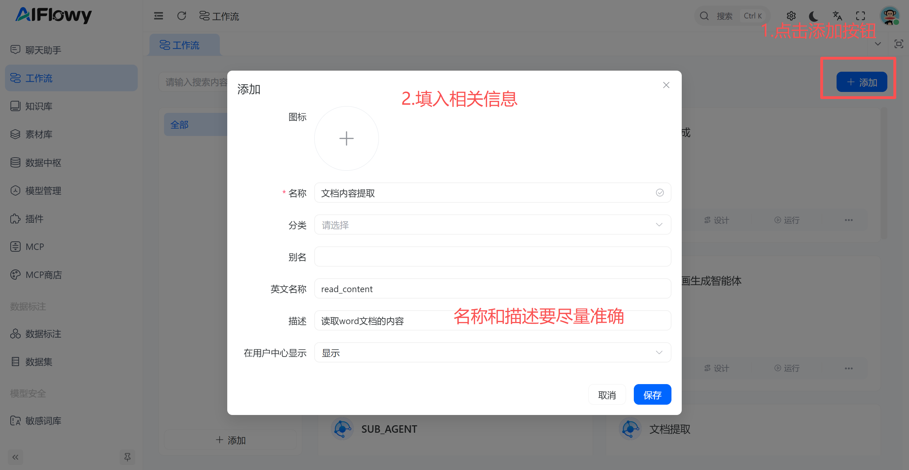
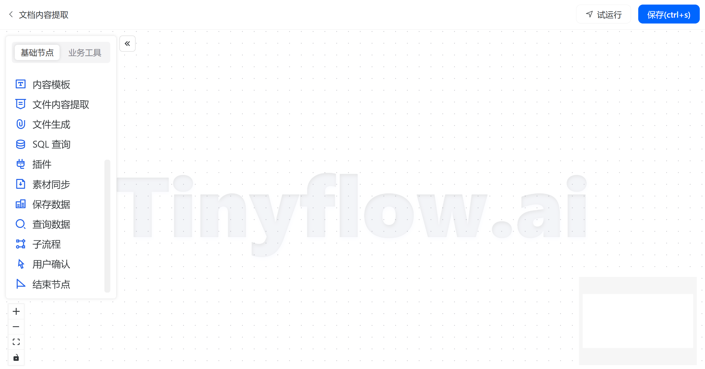
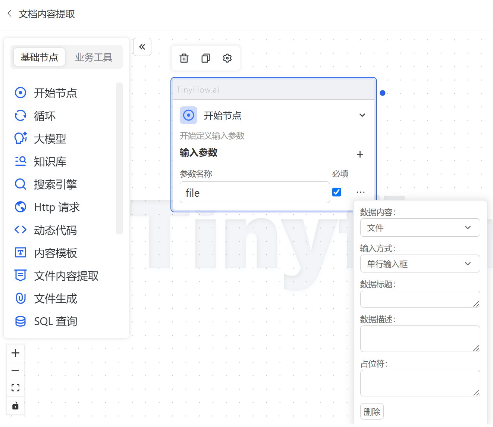
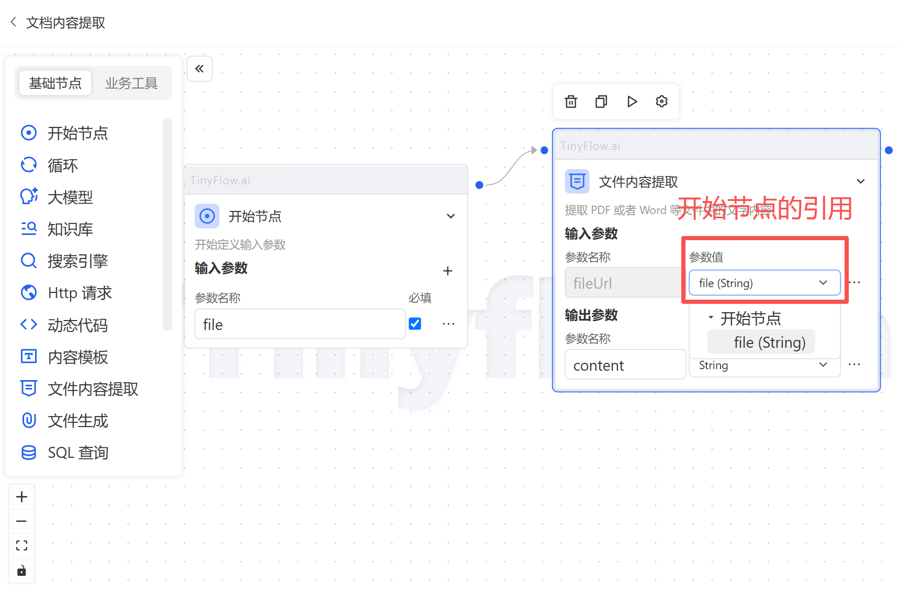
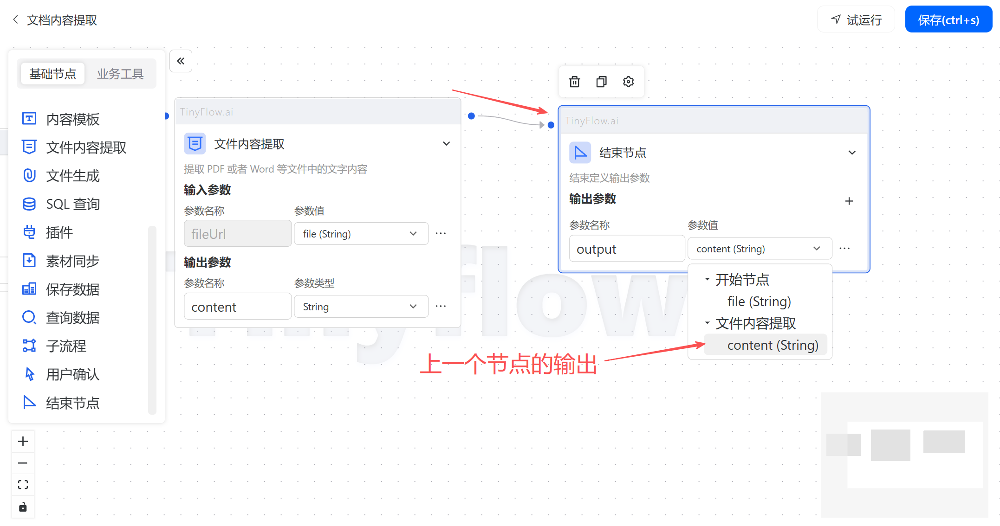
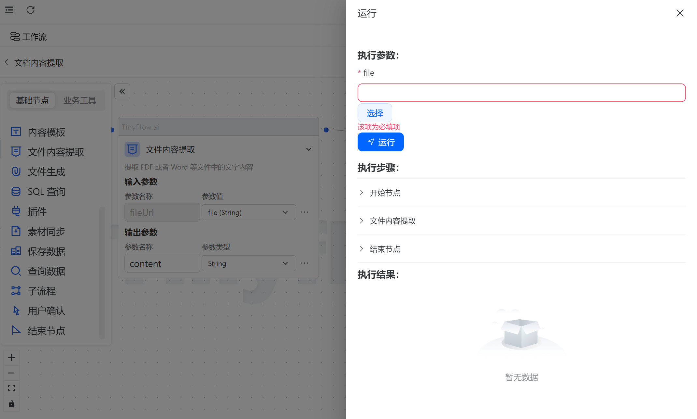
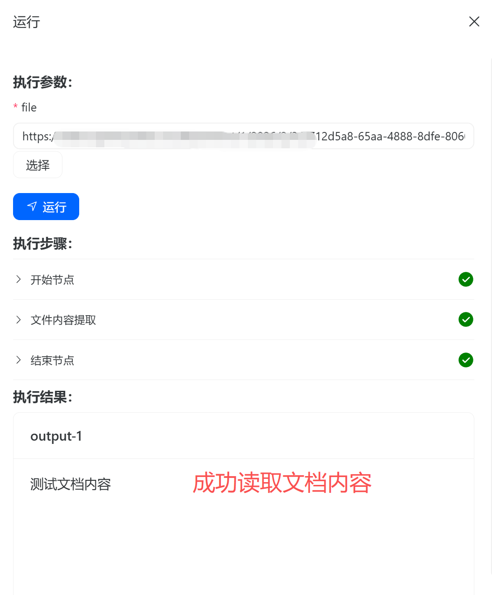

# 快速开始

## 创建工作流

找到刚才添加的工作流，点击设计按钮，来到工作流设计页面：

每个工作流需要一个`开始节点`，一个`结束节点`，至少一个`中间节点`。

- 添加开始节点：

拖动一个`开始节点`到画布上，然后配置相关参数：

- 添加中间节点：

- 添加结束节点：

这样就定义好了一个工作流，可点击右上角的 `保存按钮` 或者 `Ctrl + S` 保存。

## 试运行工作流

点击右上角的 `试运行` 按钮，弹出试运行窗口：

由于输入参数是`文件`类型，所以需要选择一个文件作为输入参数，此处的文件都由`素材库`统一管理，点击`选择`按钮，选择一个上传的文档：

选择好后点击运行即可：

